# CHASM: Coordinated Heterogeneous Application State Machines

## Overview

CHASM is a framework for building durable, stateful components within Temporal Server. It provides a type-safe, tree-structured approach to managing application state with automatic persistence, task orchestration, and multi-cluster replication support.

### What is CHASM?

CHASM enables developers to implement complex stateful systems as composable components organized in a tree structure. Each component maintains its own state and lifecycle while interacting with other components through a well-defined API. The framework handles:

- **Automatic Persistence**: State changes are transparently persisted to the database
- **Lazy Deserialization**: Components are loaded on-demand to minimize memory footprint
- **Type Safety**: Strong typing throughout the API with compile-time guarantees
- **Task Orchestration**: Pure and side-effect tasks for event-driven processing
- **Multi-Cluster Support**: Built-in replication for high availability deployments
- **Consistency Guarantees**: Versioned transitions ensure linearizable state updates

### Architecture

CHASM is built on several key abstractions:

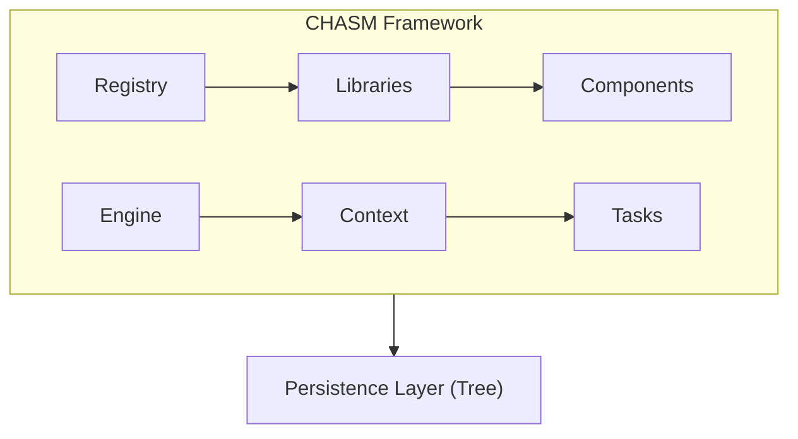

The framework separates concerns across several layers:

1. **Component Layer**: User-defined components implementing business logic
2. **Engine Layer**: Core API for creating, updating, and reading components
3. **Context Layer**: Transaction context providing access to state and task scheduling
4. **Persistence Layer**: Tree-structured storage with automatic serialization
5. **Registry Layer**: Component and task registration with type validation

### Use Cases

CHASM is designed for implementing archetypes within Temporal Server. Current implementations include:

- **Scheduler**: Schedule-based workflow execution with backfill support
- **Callback**: Asynchronous callback handling for Nexus operations
- **Workflow**: Workflow execution state machine (work in progress)

Each archetype is implemented as a CHASM library containing related components, tasks, and API handlers.

### Design Principles

CHASM follows these core principles:

1. **Type Safety**: Leverage Go's type system to catch errors at compile time
2. **Composability**: Build complex systems from simple, reusable components
3. **Explicit State**: All state changes go through well-defined transitions
4. **Transactional Updates**: Multiple state changes are committed atomically
5. **Separation of Concerns**: Framework handles persistence, components implement logic
6. **Performance**: Lazy loading and efficient serialization minimize overhead

### Documentation Structure

This documentation is organized as follows:

- **Terminology**: Core concepts and definitions
- **Core Interfaces**: Component, Engine, Context, and MutableContext
- **Field System**: Type-safe state management with Field[T]
- **State Machines**: Building state machines with transitions
- **Task System**: Pure and side-effect task execution
- **Library Architecture**: Creating and registering CHASM libraries
- **Examples**: Common patterns and usage examples

For archetype implementations, see:
- [`lib/README.md`](lib/README.md) - Overview of archetype implementations
- [`lib/scheduler/README.md`](lib/scheduler/README.md) - Scheduler archetype details
- [`lib/callback/README.md`](lib/callback/README.md) - Callback archetype details

---

## Terminology

This section defines the core concepts used throughout CHASM.

### Archetype

An **Archetype** is the fully qualified name of the root component type for a CHASM execution. It identifies what kind of execution is being created.

```go
type Archetype = string

// Examples of archetypes:
const (
    WorkflowArchetype  = "workflow.workflow"
    SchedulerArchetype = "scheduler.scheduler"
)
```

Archetypes serve as templates that define:
- The root component structure
- Available sub-components
- Task types that can be scheduled
- API endpoints for interaction

Each archetype is implemented as a CHASM library and registered with the framework's Registry.

### ArchetypeID

An **ArchetypeID** is CHASM's internal 32-bit identifier for an Archetype, generated deterministically from the archetype name using a hash function.

```go
type ArchetypeID = uint32
```

The ArchetypeID provides:
- Fast archetype lookup without string comparison
- Compact representation in persistence layer
- Validation that loaded executions match expected types

### Execution

An **Execution** is a running instance of an Archetype. The lifetime of a single execution may consist of multiple non-overlapping runs.

Key properties:
- Identified by a unique `ExecutionKey` (NamespaceID + BusinessID + RunID)
- May transition through multiple runs with the same BusinessID
- Contains a tree of components representing its state
- Persists across server restarts and failovers

Examples of executions:
- A workflow execution running specific business logic
- A scheduler execution managing periodic workflow invocations
- A callback execution tracking an asynchronous operation

Multiple runs can share the same BusinessID (for example, when a workflow is continued-as-new), but only one execution with a given BusinessID can be in a non-terminal state at any time within a namespace.

### BusinessID

A **BusinessID** is a user-provided string identifier for an execution that should be meaningful in the user's domain. It is guaranteed to be unique among non-terminal executions within a namespace.

```go
type ExecutionKey struct {
    NamespaceID string
    BusinessID  string  // User-defined identifier
    RunID       string  // System-generated per run
}
```

Characteristics:
- **User-defined**: Applications choose meaningful IDs (e.g., "user-123-onboarding")
- **Uniqueness**: Only one open execution per BusinessID per namespace
- **Reusability**: Can be reused after an execution closes (depending on policy)
- **Idempotency**: Enables idempotent execution creation

BusinessID is analogous to WorkflowID in Temporal's workflow execution model.

### Component

A **Component** is a node in the execution tree that has:
- State (represented as fields)
- Behavior (methods implementing business logic)
- Lifecycle (running, completed, failed)
- Child components (forming a tree structure)

```go
type Component interface {
    LifecycleState(Context) LifecycleState
    Terminate(MutableContext, TerminateComponentRequest) (TerminateComponentResponse, error)
    mustEmbedUnimplementedComponent()
}
```

Components are the primary abstraction for organizing application logic. An execution's component tree might look like:

```
Scheduler (root)
├── Generator (schedules actions)
├── Invoker (executes actions)
└── Backfillers (map)
    ├── Backfiller["backfill-1"]
    └── Backfiller["backfill-2"]
```

Each component:
- Is strongly typed with compile-time validation
- Can contain data fields and sub-component fields
- Receives tasks from the framework for processing
- Can schedule new tasks via the MutableContext

### ComponentRef

A **ComponentRef** is a reference to a specific component within an execution at a specific point in its transition history. It uniquely identifies a component across all clusters in a multi-cluster configuration.

```go
type ComponentRef struct {
    ExecutionKey                              // Identifies the execution
    
    // Internal fields (managed by framework)
    archetypeID           ArchetypeID         // Type validation
    executionGoType       reflect.Type        // Component type for archetype lookup
    executionLastUpdateVT *VersionedTransition // Consistency token for execution
    componentPath         []string            // Path from root to component
    componentInitialVT    *VersionedTransition // When component was created
}
```

ComponentRefs provide:
- **Consistency**: Version tokens detect concurrent modifications
- **Addressability**: Locate specific components in the tree
- **Durability**: Serializable references that survive across RPCs
- **Type Safety**: Validated archetype at deserialization time

Example usage:

```go
// Create a reference to a Scheduler component
ref := chasm.NewComponentRef[*scheduler.Scheduler](executionKey)

// Use the reference to update the component
output, newRef, err := chasm.UpdateComponent(ctx, ref, 
    func(s *scheduler.Scheduler, ctx chasm.MutableContext, input Request) (Response, error) {
        // Update logic here
    }, request)
```

### ComponentPath

A **ComponentPath** is the sequence of field names from the root component to a specific component in the tree.

```go
// Example: Accessing a backfiller within a scheduler
path := []string{"Backfillers", "backfill-1"}
```

The path is encoded in the ComponentRef and used by the framework to:
- Navigate the component tree during deserialization
- Support partial loading (future optimization)
- Generate unique identifiers for persistence

### LifecycleState

A **LifecycleState** represents the current state of a component's lifecycle.

```go
type LifecycleState int

const (
    LifecycleStateRunning   LifecycleState = 2 << iota
    LifecycleStateCompleted
    LifecycleStateFailed
)

func (s LifecycleState) IsClosed() bool {
    return s >= LifecycleStateCompleted
}
```

Components transition through lifecycle states:
- **Running**: Component is active and processing
- **Completed**: Component finished successfully
- **Failed**: Component encountered an error

The framework tracks lifecycle states to:
- Determine when components can be garbage collected
- Validate that operations are called on valid components
- Generate visibility updates for monitoring

---

## Core Interfaces

CHASM defines several core interfaces that form the foundation of the framework. Understanding these interfaces is essential for implementing and using CHASM components.

### Component Interface

The `Component` interface is the base abstraction that all CHASM components must implement.

```go
type Component interface {
    LifecycleState(Context) LifecycleState
    Terminate(MutableContext, TerminateComponentRequest) (TerminateComponentResponse, error)
    mustEmbedUnimplementedComponent()
}
```

**Methods:**

- `LifecycleState(Context) LifecycleState`: Returns the current lifecycle state (Running, Completed, or Failed)
- `Terminate(MutableContext, TerminateComponentRequest)`: Handles termination requests from external callers

**Implementation Pattern:**

All components should embed `UnimplementedComponent` to ensure forward compatibility:

```go
type MyComponent struct {
    chasm.UnimplementedComponent
    
    // Component state
    State *pb.MyComponentState
    
    // Sub-components
    Child chasm.Field[*ChildComponent]
}

func (c *MyComponent) LifecycleState(ctx chasm.Context) chasm.LifecycleState {
    if c.State.Completed {
        return chasm.LifecycleStateCompleted
    }
    if c.State.Failed {
        return chasm.LifecycleStateFailed
    }
    return chasm.LifecycleStateRunning
}
```

### Engine Interface

The `Engine` interface provides the core API for interacting with CHASM executions. It is the primary entry point for creating, updating, and reading components.

```go
type Engine interface {
    NewExecution(
        context.Context,
        ComponentRef,
        func(MutableContext) (Component, error),
        ...TransitionOption,
    ) (ExecutionKey, []byte, error)
    
    UpdateWithNewExecution(
        context.Context,
        ComponentRef,
        func(MutableContext) (Component, error),
        func(MutableContext, Component) error,
        ...TransitionOption,
    ) (ExecutionKey, []byte, error)
    
    UpdateComponent(
        context.Context,
        ComponentRef,
        func(MutableContext, Component) error,
        ...TransitionOption,
    ) ([]byte, error)
    
    ReadComponent(
        context.Context,
        ComponentRef,
        func(Context, Component) error,
        ...TransitionOption,
    ) error
    
    PollComponent(
        context.Context,
        ComponentRef,
        func(Context, Component) (any, bool, error),
        func(MutableContext, Component, any) error,
        ...TransitionOption,
    ) ([]byte, error)
}
```

**Type-Safe Wrappers:**

The framework provides generic wrapper functions that handle types automatically:

```go
// Pattern: NewExecution(ctx, key, constructorFunc, input, ...opts)
output, executionKey, ref, err := chasm.NewExecution(ctx, key, CreateScheduler, request)

// Pattern: UpdateComponent(ctx, ref, methodOrFunc, input, ...opts)
output, newRef, err := chasm.UpdateComponent(ctx, ref, (*Scheduler).Update, request)

// Pattern: ReadComponent(ctx, ref, methodOrFunc, input, ...opts)
output, err := chasm.ReadComponent(ctx, ref, (*Scheduler).Describe, request)
```

See the `handler.UpdateSchedule` method in [`lib/scheduler/handler.go`](lib/scheduler/handler.go).

**Operations:**

- **NewExecution**: Creates a new execution with a root component
- **UpdateWithNewExecution**: Creates a new execution or updates existing (create-or-update pattern)
- **UpdateComponent**: Modifies a component's state within a transaction
- **ReadComponent**: Reads component state without modification (read-only transaction)
- **PollComponent**: Atomically checks a condition and updates if condition is met

### Context Interface

Provides **read-only** access to component tree and execution metadata:

```go
type Context interface {
    Ref(Component) ([]byte, error)     // Get serialized component reference
    Now(Component) time.Time            // Deterministic time for replay safety
    ExecutionKey() ExecutionKey         // Current execution identity
}
```

Used in read-only operations, validators, and side-effect tasks.

### MutableContext Interface

Extends `Context` with **write** capabilities:

```go
type MutableContext interface {
    Context
    AddTask(Component, TaskAttributes, any)  // Schedule async task
}
```

**Key Pattern:** Use `ctx.AddTask()` to schedule work, `ctx.Now()` for timestamps, modify component fields directly.

```go
// Typical usage in component method
func (s *Scheduler) Update(ctx chasm.MutableContext, req Request) (Response, error) {
    s.State.UpdatedAt = timestamppb.New(ctx.Now(s))
    ctx.AddTask(s, chasm.TaskAttributes{}, &SchedulerTask{})
    return &Response{}, nil
}
```

See the `Scheduler.Update` method in [`lib/scheduler/scheduler.go`](lib/scheduler/scheduler.go).

### TransitionOptions

Control execution creation and state transitions:

```go
// Common options passed to NewExecution, UpdateComponent, etc.
chasm.WithRequestID("req-123")                    // Idempotency
chasm.WithBusinessIDPolicy(reusePolicy, conflictPolicy)  // Duplicate handling
chasm.WithSpeculative()                           // Don't persist yet
```

Most commonly used: `WithRequestID()` for idempotent creation.

**BusinessID Policies:**

- **ReusePolicy**: Controls reusing BusinessID after execution closes
  - `AllowDuplicate`: Always allow
  - `AllowDuplicateFailedOnly`: Only if previous failed
  - `RejectDuplicate`: Never allow

- **ConflictPolicy**: What to do if BusinessID already exists
  - `Fail`: Return error
  - `TerminateExisting`: Close existing execution
  - `UseExisting`: Return existing execution

---

## Field System and Tree Structure

CHASM organizes component state in a tree structure where each node can contain data fields, component fields, or collections. The `Field[T]` type provides type-safe access with lazy deserialization.

### Field[T] Type

The `Field[T]` is a generic wrapper that represents a typed field in a component. It supports both data (protobuf messages) and sub-components.

```go
type Field[T any] struct {
    Internal fieldInternal
}
```

**Key Operations:**

```go
// Get the value (panics if not found)
value := field.Get(ctx)

// Try to get the value (returns false if not found)
value, ok := field.TryGet(ctx)
```

### Field Types

CHASM supports several types of fields:

#### Data Fields

Data fields store protobuf messages directly within the component:

```go
type MyComponent struct {
    chasm.UnimplementedComponent
    
    // Data field containing a protobuf message
    Config chasm.Field[*pb.Configuration]
    Status chasm.Field[*pb.Status]
}

// Create a data field
func NewMyComponent(ctx chasm.MutableContext) *MyComponent {
    return &MyComponent{
        Config: chasm.NewDataField(ctx, &pb.Configuration{
            Timeout: 300,
        }),
        Status: chasm.NewDataField(ctx, &pb.Status{
            State: "RUNNING",
        }),
    }
}

// Read a data field
func (c *MyComponent) GetConfig(ctx chasm.Context) *pb.Configuration {
    return c.Config.Get(ctx)
}
```

#### Component Fields

Component fields reference child components in the tree:

```go
type MyComponent struct {
    chasm.UnimplementedComponent
    
    // Component field referencing a child
    Worker chasm.Field[*WorkerComponent]
}

// Create a component field
func NewMyComponent(ctx chasm.MutableContext) *MyComponent {
    return &MyComponent{
        Worker: chasm.NewComponentField(ctx, NewWorkerComponent(ctx)),
    }
}

// Access child component
func (c *MyComponent) ProcessWork(ctx chasm.MutableContext) error {
    worker := c.Worker.Get(ctx)
    return worker.DoWork(ctx)
}
```

#### Pointer Fields

Pointer fields store references to other components without embedding them. This allows sharing components or creating non-tree references.

```go
type MyComponent struct {
    chasm.UnimplementedComponent
    
    // Pointer to a component elsewhere in the tree
    SharedResource chasm.Field[*ResourceComponent]
}

// Create a pointer at transaction commit time
func (c *MyComponent) LinkResource(ctx chasm.MutableContext, resource *ResourceComponent) {
    c.SharedResource = chasm.ComponentPointerTo(ctx, resource)
}

// Create a data pointer
func (c *MyComponent) CacheValue(ctx chasm.MutableContext, data *pb.CachedData) {
    c.CachedValue = chasm.DataPointerTo(ctx, data)
}
```

**Deferred Pointers**: Pointers are resolved at transaction commit time, allowing forward references.

### Map Collections

Dynamic collections of components:

```go
type Map[K string | int | int8 | int32 | int64 | uint | uint8 | uint32 | uint64 | bool, T any] map[K]Field[T]

// Usage pattern
type Scheduler struct {
    Backfillers chasm.Map[string, *Backfiller]  // Dynamic child components
}

// Add to map
s.Backfillers[id] = chasm.NewComponentField(ctx, backfiller)

// Access from map
field, ok := s.Backfillers[id]
backfiller, exists := field.TryGet(ctx)
```

See the `Scheduler` struct's field definitions in [`lib/scheduler/scheduler.go`](lib/scheduler/scheduler.go) for production Map usage.

### Tree Structure

Components are organized in a tree structure where:

1. Each execution has a single root component (the archetype)
2. Components can have child components via `Field[*ChildComponent]`
3. Components can have dynamic children via `Map[K, *ChildComponent]`
4. Each node in the tree has a unique path from the root

**Example Tree:**

```
Scheduler (root)
├── LastCompletionResult (data)
├── Generator (component)
│   └── State (data)
├── Invoker (component)
│   ├── State (data)
│   └── Buffer (data)
└── Backfillers (map)
    ├── ["backfill-1"] → Backfiller
    │   └── State (data)
    └── ["backfill-2"] → Backfiller
        └── State (data)
```

### Lazy Deserialization

Fields deserialize on-demand:
- Call `field.Get(ctx)` → deserializes if needed
- Never accessed → never deserialized
- Reduces memory usage for large trees

### Empty Fields

Optional fields use `TryGet` to check existence:

```go
// Check if field has value
child, ok := c.OptionalChild.TryGet(ctx)
if !ok {
    // Field is empty, create it
    c.OptionalChild = chasm.NewComponentField(ctx, NewChild(ctx))
}

// Or explicitly create empty
c.OptionalChild = chasm.NewEmptyField[*ChildComponent]()
```

### Field Serialization

The framework automatically handles serialization:

1. **On Read**: Deserialize from persistence layer on-demand
2. **On Write**: Serialize all modified fields at transaction commit
3. **Incremental**: Only modified fields are serialized and persisted

**Serialization Process:**

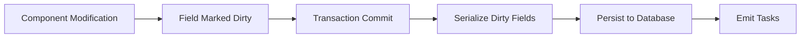

### Best Practices

**Do:**
- Use `TryGet()` when field might be empty
- Organize related state in data fields
- Use Maps for dynamic collections
- Keep component tree shallow when possible

**Don't:**
- Access fields without Context (will panic)
- Modify fields without MutableContext
- Create circular references (use pointers instead)
- Nest Maps deeply (performance impact)

---

## State Machines and Transitions

CHASM provides built-in support for implementing state machines with type-safe transitions. The framework ensures that state transitions are valid and properly sequenced.

### StateMachine Interface

Components can implement state machine behavior by embedding the `StateMachine` interface:

```go
type StateMachine[S comparable] interface {
    StateMachineState() S
    SetStateMachineState(S)
}
```

**Type Parameter `S`**: The state type must be comparable (e.g., int, string, custom enum type).

### Transition Type

The `Transition` type represents a state transition with validation:

```go
type Transition[S comparable, SM StateMachine[S], E any] struct {
    Sources     []S  // Valid source states
    Destination S    // Target state
    apply       func(SM, MutableContext, E) error
}
```

**Type Parameters:**
- `S`: State type (comparable)
- `SM`: State machine type
- `E`: Event type that triggers the transition

### Creating Transitions

Use `NewTransition` to create validated transitions:

```go
type SchedulerState int

const (
    StateInitial SchedulerState = iota
    StateRunning
    StatePaused
    StateCompleted
)

type MyScheduler struct {
    chasm.UnimplementedComponent
    state SchedulerState
}

func (s *MyScheduler) StateMachineState() SchedulerState {
    return s.state
}

func (s *MyScheduler) SetStateMachineState(state SchedulerState) {
    s.state = state
}

// Define transitions
var (
    transitionStart = chasm.NewTransition(
        []SchedulerState{StateInitial},      // Can only start from Initial
        StateRunning,                          // Moves to Running
        func(s *MyScheduler, ctx chasm.MutableContext, event StartEvent) error {
            // Transition logic
            s.StartTime = ctx.Now(s)
            ctx.AddTask(s, chasm.TaskAttributes{}, &ProcessTask{})
            return nil
        },
    )
    
    transitionPause = chasm.NewTransition(
        []SchedulerState{StateRunning},       // Can only pause when Running
        StatePaused,
        func(s *MyScheduler, ctx chasm.MutableContext, event PauseEvent) error {
            s.PauseReason = event.Reason
            return nil
        },
    )
    
    transitionResume = chasm.NewTransition(
        []SchedulerState{StatePaused},        // Can only resume when Paused
        StateRunning,
        func(s *MyScheduler, ctx chasm.MutableContext, event ResumeEvent) error {
            s.PauseReason = ""
            ctx.AddTask(s, chasm.TaskAttributes{}, &ProcessTask{})
            return nil
        },
    )
    
    transitionComplete = chasm.NewTransition(
        []SchedulerState{StateRunning, StatePaused},  // Can complete from multiple states
        StateCompleted,
        func(s *MyScheduler, ctx chasm.MutableContext, event CompleteEvent) error {
            s.CompletionTime = ctx.Now(s)
            s.Result = event.Result
            return nil
        },
    )
)
```

### Applying Transitions

Use the `Apply` method to execute a transition:

```go
func (s *MyScheduler) Start(ctx chasm.MutableContext, event StartEvent) error {
    if err := transitionStart.Apply(ctx, s, event); err != nil {
        return err
    }
    return nil
}

func (s *MyScheduler) Pause(ctx chasm.MutableContext, event PauseEvent) error {
    if err := transitionPause.Apply(ctx, s, event); err != nil {
        if errors.Is(err, chasm.ErrInvalidTransition) {
            return fmt.Errorf("cannot pause scheduler in state %v", s.state)
        }
        return err
    }
    return nil
}
```

**Error Handling:**

`Apply` returns `ErrInvalidTransition` if the current state is not in the `Sources` list:

```go
var ErrInvalidTransition = errors.New("invalid transition")
```

### Checking Transition Possibility

Use `Possible` to check if a transition can be applied:

```go
func (s *MyScheduler) CanPause(ctx chasm.Context) bool {
    return transitionPause.Possible(s)
}

func (s *MyScheduler) GetAvailableActions(ctx chasm.Context) []string {
    var actions []string
    if transitionPause.Possible(s) {
        actions = append(actions, "pause")
    }
    if transitionResume.Possible(s) {
        actions = append(actions, "resume")
    }
    if transitionComplete.Possible(s) {
        actions = append(actions, "complete")
    }
    return actions
}
```

### State Machine Diagram

State machines can be visualized with their transitions:

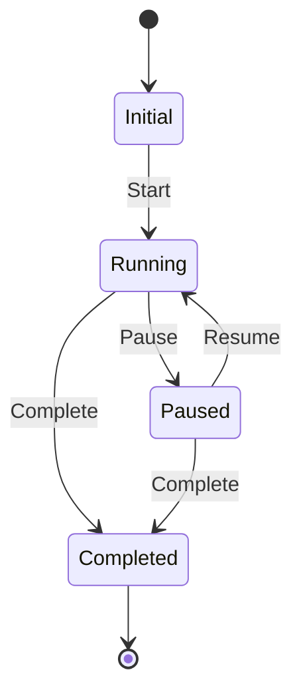

### Complex State Machines

### Organizing Transitions

For complex state machines, organize transitions in a struct:

```go
var transitions = struct {
    schedule chasm.Transition[State, *Component, ScheduleEvent]
    complete chasm.Transition[State, *Component, CompleteEvent]
}{
    schedule: chasm.NewTransition(
        []State{StateIdle},
        StateScheduling,
        func(c *Component, ctx chasm.MutableContext, e ScheduleEvent) error {
            // Transition logic
            return nil
        },
    ),
    // ... more transitions
}

// Use in component methods
func (c *Component) Schedule(ctx chasm.MutableContext, e ScheduleEvent) error {
    return transitions.schedule.Apply(ctx, c, e)
}
```

### Multi-Source Transitions

Transitions can accept multiple source states:

```go
// Terminate from any non-terminal state
chasm.NewTransition(
    []State{StateRunning, StatePaused, StateWaiting},  // Multiple sources
    StateTerminated,
    func(c *Component, ctx chasm.MutableContext, e TerminateEvent) error {
        // Cleanup logic
        return nil
    },
)
```

### Production Examples

See complete state machine implementations:
- **Callback**: See `callbackStateMachine` in [`lib/callback/statemachine.go`](lib/callback/statemachine.go) - 5 transitions for async callback lifecycle
- **Scheduler**: Uses implicit state management (paused/running/closed flags)

### Multi-State Transitions

A transition can accept multiple source states:

```go
// Termination can happen from any non-terminal state
transitionTerminate := chasm.NewTransition(
    []MyState{StateRunning, StatePaused, StateWaiting},
    StateTerminated,
    func(s *MyComponent, ctx chasm.MutableContext, event TerminateEvent) error {
        s.TerminationReason = event.Reason
        // Clean up resources
        return nil
    },
)
```

### State Machine Best Practices

**Do:**
- Define all valid states as constants
- Use enums (iota) for integer state types
- Document state transitions in diagrams
- Validate preconditions in transition functions
- Keep state types comparable and simple
- Use descriptive event types

**Don't:**
- Modify state directly (use `SetStateMachineState`)
- Skip validation by not using `Apply`
- Create ambiguous state names
- Put complex logic in transition functions (delegate to methods)

### Example: Complete State Machine

```go
type WorkerState int

const (
    WorkerCreated WorkerState = iota
    WorkerStarting
    WorkerRunning
    WorkerStopping
    WorkerStopped
    WorkerFailed
)

type Worker struct {
    chasm.UnimplementedComponent
    state WorkerState
    *pb.WorkerData
}

func (w *Worker) StateMachineState() WorkerState     { return w.state }
func (w *Worker) SetStateMachineState(s WorkerState) { w.state = s }

var workerTransitions = struct {
    start chasm.Transition[WorkerState, *Worker, StartEvent]
    run   chasm.Transition[WorkerState, *Worker, RunEvent]
    stop  chasm.Transition[WorkerState, *Worker, StopEvent]
    fail  chasm.Transition[WorkerState, *Worker, FailEvent]
}{
    start: chasm.NewTransition(
        []WorkerState{WorkerCreated},
        WorkerStarting,
        func(w *Worker, ctx chasm.MutableContext, e StartEvent) error {
            ctx.AddTask(w, chasm.TaskAttributes{}, &InitializeTask{})
            return nil
        },
    ),
    run: chasm.NewTransition(
        []WorkerState{WorkerStarting},
        WorkerRunning,
        func(w *Worker, ctx chasm.MutableContext, e RunEvent) error {
            w.StartedAt = timestamppb.New(ctx.Now(w))
            ctx.AddTask(w, chasm.TaskAttributes{}, &WorkTask{})
            return nil
        },
    ),
    stop: chasm.NewTransition(
        []WorkerState{WorkerRunning},
        WorkerStopping,
        func(w *Worker, ctx chasm.MutableContext, e StopEvent) error {
            ctx.AddTask(w, chasm.TaskAttributes{}, &CleanupTask{})
            return nil
        },
    ),
    fail: chasm.NewTransition(
        []WorkerState{WorkerStarting, WorkerRunning, WorkerStopping},
        WorkerFailed,
        func(w *Worker, ctx chasm.MutableContext, e FailEvent) error {
            w.FailureReason = e.Reason
            return nil
        },
    ),
}

func (w *Worker) Start(ctx chasm.MutableContext, e StartEvent) error {
    return workerTransitions.start.Apply(ctx, w, e)
}

func (w *Worker) HandleTaskComplete(ctx chasm.MutableContext) error {
    return workerTransitions.run.Apply(ctx, w, RunEvent{})
}

func (w *Worker) Stop(ctx chasm.MutableContext, e StopEvent) error {
    return workerTransitions.stop.Apply(ctx, w, e)
}

func (w *Worker) HandleFailure(ctx chasm.MutableContext, e FailEvent) error {
    return workerTransitions.fail.Apply(ctx, w, e)
}
```

---

## Task System

CHASM uses tasks for asynchronous, event-driven processing. Tasks are scheduled during transactions and executed after the transaction commits. The framework distinguishes between two fundamental types of tasks: **pure tasks** and **side-effect tasks**. Understanding when to use each type is critical for building correct and efficient CHASM components.

### Task Types Overview

| Aspect | Pure Task | Side-Effect Task |
|--------|-----------|------------------|
| **Access** | Direct component instance | ComponentRef only |
| **Context** | `MutableContext` | `context.Context` |
| **Transactionality** | Runs within CHASM transaction | Runs after transaction commits |
| **State Changes** | Direct field modification | Via `UpdateComponent` calls |
| **External Calls** | ❌ Not allowed | ✅ Required use case |
| **Idempotency** | Automatic (transaction retry) | Must implement explicitly |
| **Performance** | Fast (single transaction) | Slower (needs separate update) |

### Choosing Task Type

**Use Pure Tasks when:**
- Processing scheduled events (timers, periodic checks)
- Computing state transitions based on current state
- Generating new tasks based on component state
- All work can be done with component state alone
- No external service calls needed

**Use Side-Effect Tasks when:**
- Starting workflows or activities
- Calling external APIs (HTTP, gRPC, database)
- Sending notifications or webhooks
- Interacting with Temporal APIs
- Any operation that can't be rolled back

### Task Types

#### Pure Tasks

**Pure tasks** operate entirely within a CHASM transaction. They read and modify component state through `MutableContext`.

```go
type PureTaskExecutor[C any, T any] interface {
    Execute(MutableContext, C, TaskAttributes, T) error
}
```

**Characteristics:**
- Transactional: All state changes are atomic
- Deterministic: Must produce the same result on replay
- Retryable: Can be safely retried on failure
- Efficient: Direct access to component state

**Example:**

```go
type GeneratorIdleTask struct{}

type GeneratorIdleTaskExecutor struct{}

func (e *GeneratorIdleTaskExecutor) Execute(
    ctx chasm.MutableContext,
    gen *Generator,
    attrs chasm.TaskAttributes,
    task *GeneratorIdleTask,
) error {
    // Pure task: reads and modifies component state transactionally
    if gen.HasPendingActions() {
        return gen.ScheduleNextAction(ctx)
    }
    return nil
}

func (e *GeneratorIdleTaskExecutor) Validate(
    ctx chasm.Context,
    gen *Generator,
    attrs chasm.TaskAttributes,
    task *GeneratorIdleTask,
) (bool, error) {
    // Check if task is still valid
    return !gen.IsClosed(), nil
}
```

#### Side-Effect Tasks

**Side-effect tasks** perform operations outside CHASM, such as calling external APIs or starting workflows. They receive a `ComponentRef` instead of direct component access.

```go
type SideEffectTaskExecutor[C any, T any] interface {
    Execute(context.Context, ComponentRef, TaskAttributes, T) error
}
```

**Characteristics:**
- Non-transactional: Execute after transaction commits
- May have side effects: Network calls, workflow starts, etc.
- Use ComponentRef: Must update state via Engine API
- Idempotency: Should handle duplicate execution

**Example:**

```go
type InvokerExecuteTask struct {
    WorkflowID string
    Request    *commonpb.Payloads
}

type InvokerExecuteTaskExecutor struct {
    workflowClient client.Client
}

func (e *InvokerExecuteTaskExecutor) Execute(
    ctx context.Context,
    ref chasm.ComponentRef,
    attrs chasm.TaskAttributes,
    task *InvokerExecuteTask,
) error {
    // Side-effect: Start a workflow
    run, err := e.workflowClient.ExecuteWorkflow(ctx, 
        client.StartWorkflowOptions{
            ID: task.WorkflowID,
        },
        "MyWorkflow",
        task.Request,
    )
    if err != nil {
        return err
    }
    
    // Update component state via Engine
    _, _, err = chasm.UpdateComponent(
        ctx,
        ref,
        func(inv *Invoker, ctx chasm.MutableContext, input struct{}) (struct{}, error) {
            inv.PendingWorkflowID = run.GetID()
            inv.PendingRunID = run.GetRunID()
            return struct{}{}, nil
        },
        struct{}{},
    )
    
    return err
}

func (e *InvokerExecuteTaskExecutor) Validate(
    ctx chasm.Context,
    inv *Invoker,
    attrs chasm.TaskAttributes,
    task *InvokerExecuteTask,
) (bool, error) {
    // Validate task hasn't been superseded
    return inv.State == InvokerStateExecuting, nil
}
```

### TaskAttributes

Task metadata controls when and where tasks execute:

```go
type TaskAttributes struct {
    ScheduledTime time.Time  // When to execute the task
    Destination   string     // Target queue/worker (optional)
}
```

**Scheduling:**

```go
// Immediate execution
ctx.AddTask(component, chasm.TaskAttributes{
    ScheduledTime: chasm.TaskScheduledTimeImmediate,
}, &MyTask{})

// Delayed execution
ctx.AddTask(component, chasm.TaskAttributes{
    ScheduledTime: ctx.Now(component).Add(5 * time.Minute),
}, &ReminderTask{})

// Target specific destination
ctx.AddTask(component, chasm.TaskAttributes{
    ScheduledTime: chasm.TaskScheduledTimeImmediate,
    Destination:   "special-worker-pool",
}, &HeavyTask{})
```

### Task Validation

Both task types must implement validation to determine if the task is still relevant:

```go
type TaskValidator[C any, T any] interface {
    Validate(Context, C, TaskAttributes, T) (bool, error)
}
```

**Purpose:**
- Avoid processing stale tasks
- Handle component state changes since task was scheduled
- Return `false` to skip execution

**Example:**

```go
func (e *IdleTaskExecutor) Validate(
    ctx chasm.Context,
    scheduler *Scheduler,
    attrs chasm.TaskAttributes,
    task *IdleTask,
) (bool, error) {
    // Don't execute if scheduler is closed
    if scheduler.Closed {
        return false, nil
    }
    
    // Don't execute if paused
    if scheduler.Paused {
        return false, nil
    }
    
    return true, nil
}
```

### Execution Model Differences

**Pure Task Flow:**
1. Load component → Validate → Execute in transaction → Commit atomically
2. Direct component access via `MutableContext`
3. Automatic rollback on failure

**Side-Effect Task Flow:**
1. Task persisted → Execute after commit → Call external system → Update component state
2. Only has `ComponentRef`, must use `UpdateComponent` to persist results
3. No automatic rollback - must handle idempotency

**Key Difference:** Pure tasks are transactional (changes are atomic). Side-effect tasks are two-phase (external call + state update).

See production examples:
- **Pure Task**: See `GeneratorTaskExecutor.Execute` in [`lib/scheduler/generator_tasks.go`](lib/scheduler/generator_tasks.go)
- **Side-Effect Task**: See `InvokerExecuteTaskExecutor.Execute` in [`lib/scheduler/invoker_tasks.go`](lib/scheduler/invoker_tasks.go)

### Task Idempotency

**Pure Tasks:** Automatic - transaction rollback ensures retry with original state.

**Side-Effect Tasks:** Must implement explicitly. Strategies:
- Use idempotent APIs (e.g., `WORKFLOW_ID_REUSE_POLICY_ALLOW_DUPLICATE`)
- Check state before acting (read component to see if already done)
- Use deduplication keys (request IDs based on task attempt number)

**Why it matters:** Side effect may succeed but state update fail. On retry, side effect executes again. Design for this.

### Error Handling

**Pure Tasks:** Return error → transaction rolls back → retry with original state. Simple.

**Side-Effect Tasks:** Consider partial completion:
- Side effect succeeded but update failed? Record failure for visibility.
- Update succeeded but side effect had transient error? Don't retry unnecessarily.
- Use validator to check if work already done.

### Registering Tasks

Tasks are registered with a Library:

```go
func (l *MyLibrary) Tasks() []*chasm.RegistrableTask {
    return []*chasm.RegistrableTask{
        // Pure task
        chasm.NewRegistrablePureTask(
            "processEvent",
            &ProcessEventTaskExecutor{},  // Validator
            &ProcessEventTaskExecutor{},  // Executor
        ),
        
        // Side-effect task
        chasm.NewRegistrableSideEffectTask(
            "callExternalAPI",
            &CallAPITaskExecutor{},  // Validator
            &CallAPITaskExecutor{},  // Executor
        ),
    }
}
```

### Task Execution Flow

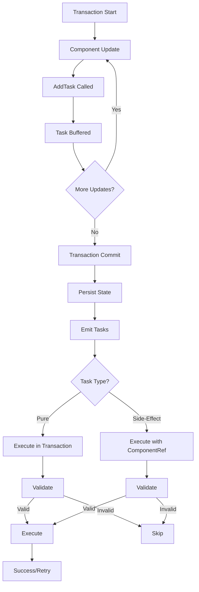

### Common Task Patterns

**Periodic Tasks:** Re-schedule at end of execution
```go
// At end of task
ctx.AddTask(component, chasm.TaskAttributes{
    ScheduledTime: ctx.Now(component).Add(interval),
}, task)
```

**Conditional Tasks:** Schedule based on state
```go
if c.Value > threshold {
    ctx.AddTask(c, chasm.TaskAttributes{}, &AlertTask{})
}
```

**Retry with Backoff:** Use scheduled time for delays
```go
delay := time.Duration(math.Pow(2, float64(attempts))) * time.Second
ctx.AddTask(component, chasm.TaskAttributes{
    ScheduledTime: ctx.Now(component).Add(delay),
}, &RetryTask{Attempts: attempts + 1})
```

See the backoff logic in `InvokeCallbackSideEffectExecutor.Execute` in [`lib/callback/executors.go`](lib/callback/executors.go).

### Task Payload Design

Task payloads should be:

```go
// Good: Small, specific payload
type ProcessOrderTask struct {
    OrderID   string
    Action    string
}

// Bad: Large embedded data
type ProcessOrderTask struct {
    Order *Order  // Potentially large
    Items []*Item // Unbounded array
}

// Better: Reference by ID
type ProcessOrderTask struct {
    OrderID string  // Load from component state
}
```

---

## Library and Registry Architecture

CHASM organizes components and tasks into Libraries, which are registered with a central Registry. This architecture provides modularity, type safety, and extensibility.

### Library Interface

A Library packages related components, tasks, and API handlers:

```go
type Library interface {
    Name() string
    Components() []*RegistrableComponent
    Tasks() []*RegistrableTask
    RegisterServices(server *grpc.Server)
    
    mustEmbedUnimplementedLibrary()
}
```

**Methods:**

- `Name()`: Unique library identifier (e.g., "scheduler", "callback")
- `Components()`: List of components provided by this library
- `Tasks()`: List of tasks that can be executed
- `RegisterServices()`: Register gRPC service handlers

### Creating a Library

Implement the Library interface by embedding `UnimplementedLibrary`:

```go
type MyLibrary struct {
    chasm.UnimplementedLibrary
    
    // Task executors as dependencies
    processTaskExecutor *ProcessTaskExecutor
    syncTaskExecutor    *SyncTaskExecutor
    
    // API handler
    handler *myHandler
}

func NewMyLibrary(
    processTaskExecutor *ProcessTaskExecutor,
    syncTaskExecutor *SyncTaskExecutor,
    handler *myHandler,
) *MyLibrary {
    return &MyLibrary{
        processTaskExecutor: processTaskExecutor,
        syncTaskExecutor:    syncTaskExecutor,
        handler:             handler,
    }
}

func (l *MyLibrary) Name() string {
    return "mylib"
}

func (l *MyLibrary) Components() []*chasm.RegistrableComponent {
    return []*chasm.RegistrableComponent{
        chasm.NewRegistrableComponent[*MyComponent]("mycomponent"),
        chasm.NewRegistrableComponent[*SubComponent]("subcomponent"),
    }
}

func (l *MyLibrary) Tasks() []*chasm.RegistrableTask {
    return []*chasm.RegistrableTask{
        chasm.NewRegistrablePureTask(
            "process",
            l.processTaskExecutor,
            l.processTaskExecutor,
        ),
        chasm.NewRegistrableSideEffectTask(
            "sync",
            l.syncTaskExecutor,
            l.syncTaskExecutor,
        ),
    }
}

func (l *MyLibrary) RegisterServices(server *grpc.Server) {
    mypb.RegisterMyServiceServer(server, l.handler)
}
```

### RegistrableComponent

Components registered with type and options:

```go
chasm.NewRegistrableComponent[*MyComponent](
    "mycomponent",
    chasm.WithSearchAttributes(...),  // Visibility
    chasm.WithEphemeral(),            // Not persisted
    chasm.WithSingleCluster(),        // No replication
)
```

See the `NewLibrary` function in [`lib/scheduler/library.go`](lib/scheduler/library.go) for production registration.

### RegistrableTask

Tasks registered with name, validator, and executor:

```go
// Pure task
chasm.NewRegistrablePureTask("taskName", validator, executor)

// Side-effect task  
chasm.NewRegistrableSideEffectTask("taskName", validator, executor)
```

See the task registration in `NewLibrary` in [`lib/scheduler/library.go`](lib/scheduler/library.go).

### Registry

Registry manages all libraries and provides lookup by name, ID, or Go type. Libraries register automatically via FX modules.
// Create registry
registry := chasm.NewRegistry(logger)

// Register libraries
if err := registry.Register(&chasm.CoreLibrary{}); err != nil {
    return err
}
if err := registry.Register(scheduler.NewLibrary(...)); err != nil {
    return err
}
if err := registry.Register(callback.NewLibrary(...)); err != nil {
    return err
}

// Register gRPC services
registry.RegisterServices(grpcServer)
```

### Fully Qualified Names

Components and tasks use fully qualified names (FQN) combining library and type:

```
Format: {library_name}.{component_name}

Examples:
- scheduler.scheduler    (Scheduler root component)
- scheduler.generator    (Generator sub-component)
- scheduler.invoker      (Invoker sub-component)
- callback.callback      (Callback root component)
- core.vis              (Visibility component)
```

The Registry maps FQNs to numeric IDs for efficient storage:

```go
// Component ID generated from FQN via hash function
func generateTypeID(fqn string) uint32 {
    return farm.Fingerprint32([]byte(fqn))
}
```

### Built-in CoreLibrary

CHASM includes a `CoreLibrary` with framework components:

```go
type CoreLibrary struct {
    chasm.UnimplementedLibrary
}

func (l *CoreLibrary) Name() string {
    return "core"
}

func (l *CoreLibrary) Components() []*chasm.RegistrableComponent {
    return []*chasm.RegistrableComponent{
        chasm.NewRegistrableComponent[*Visibility]("vis"),
    }
}

func (l *CoreLibrary) Tasks() []*chasm.RegistrableTask {
    return []*chasm.RegistrableTask{
        chasm.NewRegistrableSideEffectTask(
            "visTask",
            defaultVisibilityTaskHandler,
            defaultVisibilityTaskHandler,
        ),
    }
}
```

**Visibility Component:**

Root components include `Visibility` field for search attributes:
```go
Visibility: chasm.NewComponentField(ctx, chasm.NewVisibility(ctx))
```

### Dependency Injection

Libraries use Uber FX modules. See the `Module` definition in [`lib/scheduler/fx.go`](lib/scheduler/fx.go) for the pattern.

### Library Structure

Typical library directory structure:

```
lib/mylib/
├── proto/
│   └── v1/
│       ├── message.proto      # State definitions
│       ├── tasks.proto         # Task definitions
│       └── service.proto       # API definitions
├── gen/
│   └── mylibpb/
│       └── v1/
│           ├── message.pb.go
│           ├── tasks.pb.go
│           └── service_grpc.pb.go
├── library.go                  # Library implementation
├── component.go                # Main component
├── subcomponent.go            # Sub-components
├── tasks.go                    # Task executors
├── handler.go                  # gRPC handler
├── config.go                   # Configuration
└── fx.go                       # Dependency injection
```

### Library Registration Flow

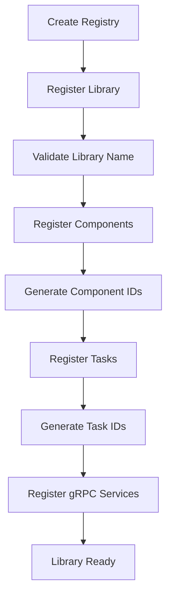

### Best Practices

**Library Design:**
- One library per archetype
- Clear naming conventions
- Comprehensive test coverage
- Document all public APIs
- Version proto definitions

**Component Registration:**
- Use descriptive component names
- Add search attributes for visibility
- Consider ephemeral vs persistent
- Document lifecycle expectations

**Task Registration:**
- Implement robust validation
- Keep task payloads small
- Make tasks idempotent
- Handle all error cases

**Dependency Injection:**
- Use FX modules for organization
- Inject only what's needed
- Avoid circular dependencies
- Test with mock dependencies

---

## gRPC Handlers and API Integration

CHASM libraries expose their functionality through gRPC service handlers that integrate with the Engine API. Handlers serve as the bridge between external API requests and CHASM component operations.

### Handler Responsibilities

Handlers perform a simple workflow:
1. Receive gRPC request from client
2. Extract `ExecutionKey` from request parameters
3. Call appropriate Engine operation (`NewExecution`, `UpdateComponent`, `ReadComponent`)
4. Pass method reference to component logic
5. Return response to client

### Three Core Patterns

**Creating Executions** - Use `NewExecution` with constructor function:
```go
// Handler delegates to constructor
resp, _, _, err := chasm.NewExecution(ctx, executionKey, CreateScheduler, req, opts...)

// Constructor initializes component
func CreateScheduler(ctx MutableContext, req Request) (*Scheduler, Response, error) {
    scheduler := NewScheduler(ctx, ...)
    return scheduler, &Response{}, nil
}
```

**Updating State** - Use `UpdateComponent` with method reference:
```go
// Handler uses method reference (preferred pattern)
resp, _, err := chasm.UpdateComponent(ctx, componentRef, (*Scheduler).Update, req)

// Component method contains business logic
func (s *Scheduler) Update(ctx MutableContext, req Request) (Response, error) {
    // Modify component state
    s.Schedule = req.Schedule
    return &Response{}, nil
}
```

**Reading State** - Use `ReadComponent` for read-only access:
```go
// Handler for queries
return chasm.ReadComponent(ctx, componentRef, (*Scheduler).Describe, req)

// Component method reads state
func (s *Scheduler) Describe(ctx Context, req Request) (Response, error) {
    return &Response{Schedule: s.Schedule}, nil
}
```

### Key Principles

**Method References > Lambdas**: Use `(*Component).MethodName` syntax for type safety and clarity. Only use inline lambdas when pre-processing is truly necessary.

**Thin Handlers**: Business logic belongs in component methods, not handlers. Handlers should be pure routing.

**Error Propagation**: Return errors directly - CHASM converts them to appropriate gRPC status codes.

**Idempotency Options**:
- `WithRequestID()` - Deduplicates creation requests
- `WithBusinessIDPolicy()` - Controls duplicate execution behavior

### Production Examples

See production handler implementations:
- **Scheduler**: [`lib/scheduler/handler.go`](lib/scheduler/handler.go) - Complete CRUD operations
- **Callback**: [`lib/callback/handler.go`](lib/callback/handler.go) - Simpler single-operation handler

### Testing Handlers

Use mock engines in tests:
```go
mockEngine := NewMockEngine(t)
ctx := chasm.NewEngineContext(context.Background(), mockEngine)
mockEngine.EXPECT().UpdateComponent(...).Return(...)
resp, err := handler.UpdateSchedule(ctx, req)
```

For integration tests, use actual Engine with test backends.

---

## Architecture Diagrams

This section provides visual representations of CHASM's architecture and key workflows.

### System Architecture

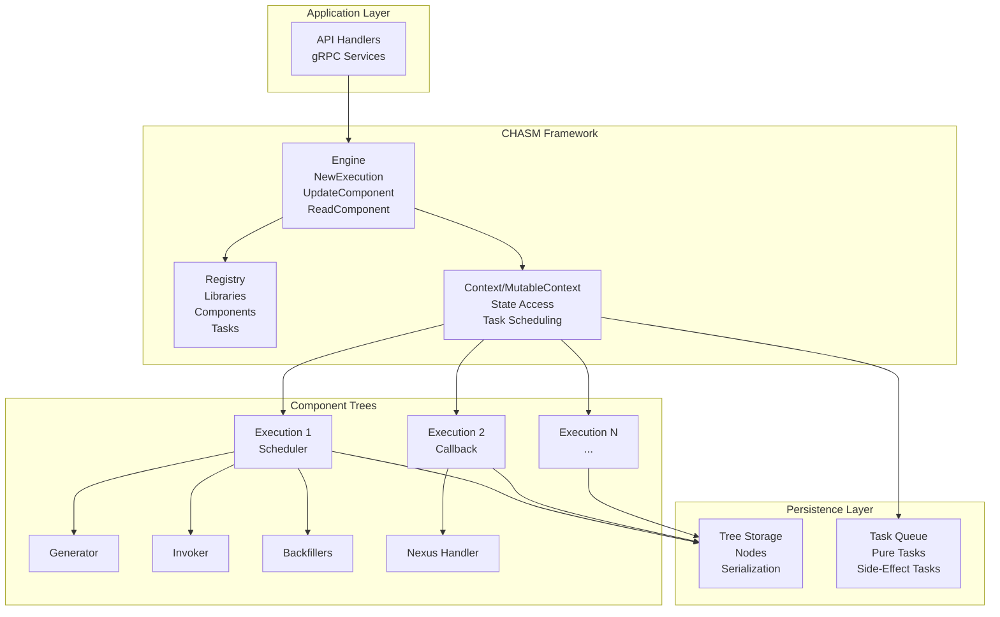

### Component Tree Structure

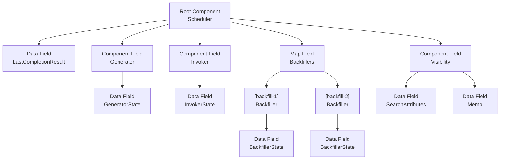

### Transaction Lifecycle

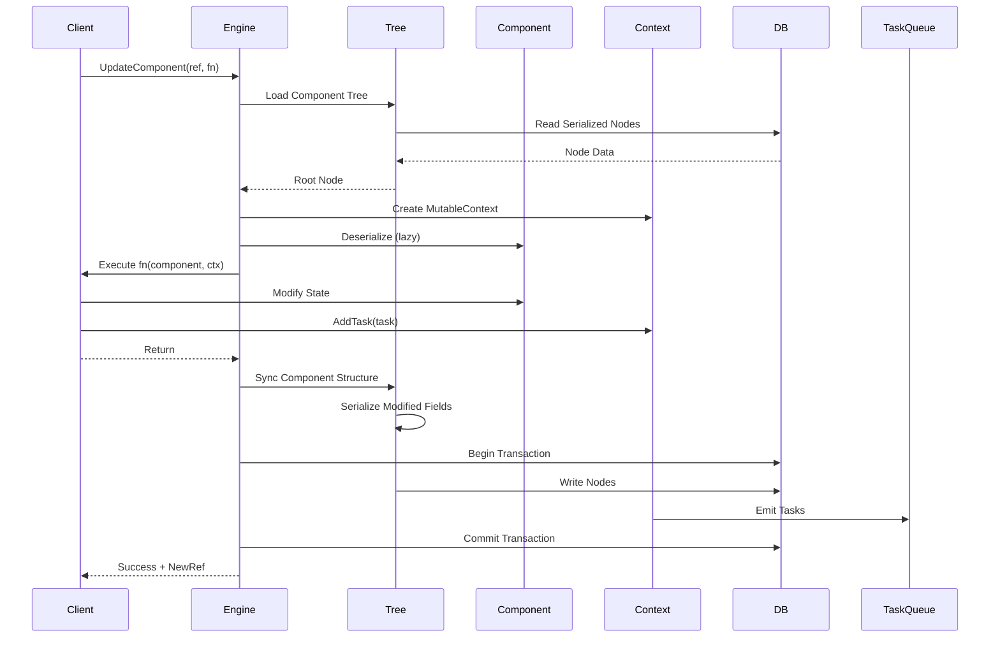

### Task Execution Flow

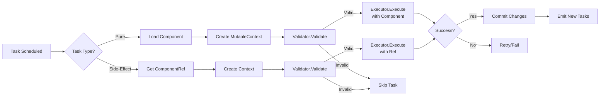

### Library Registration

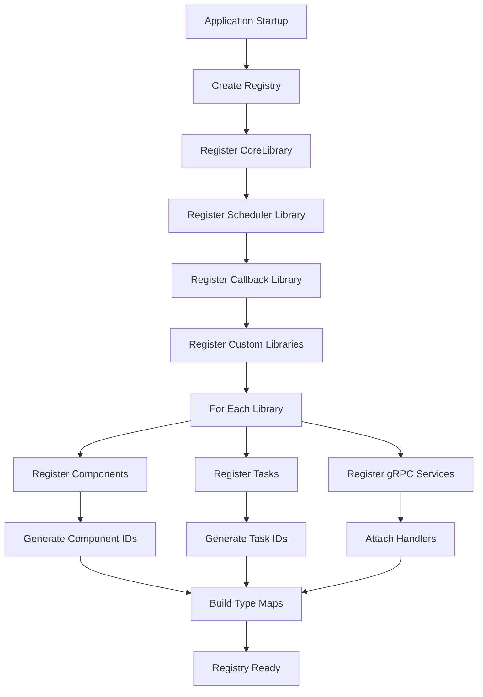

### Component Lifecycle

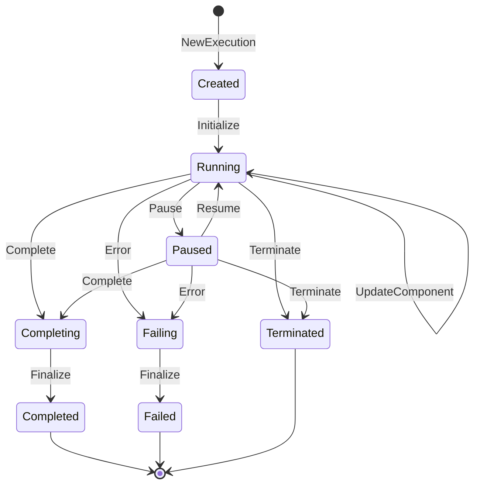

### Field Deserialization

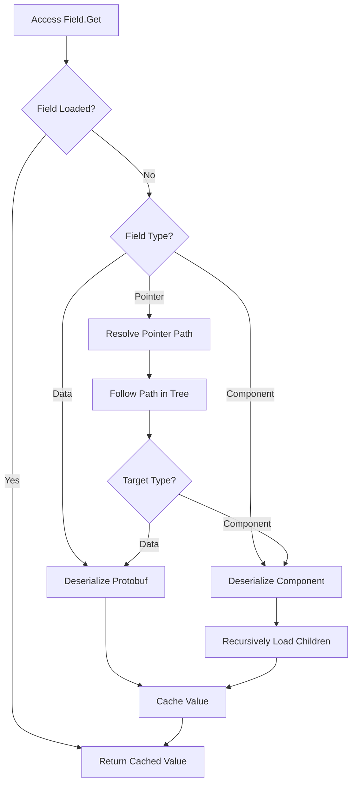

### Engine Operations

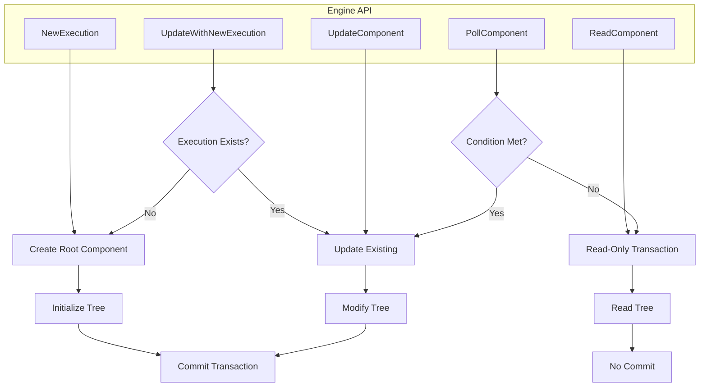

### Multi-Cluster Replication

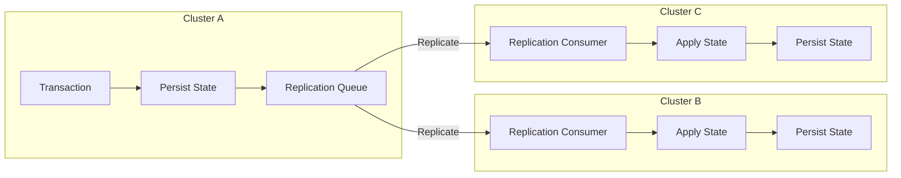

### Data Flow Example

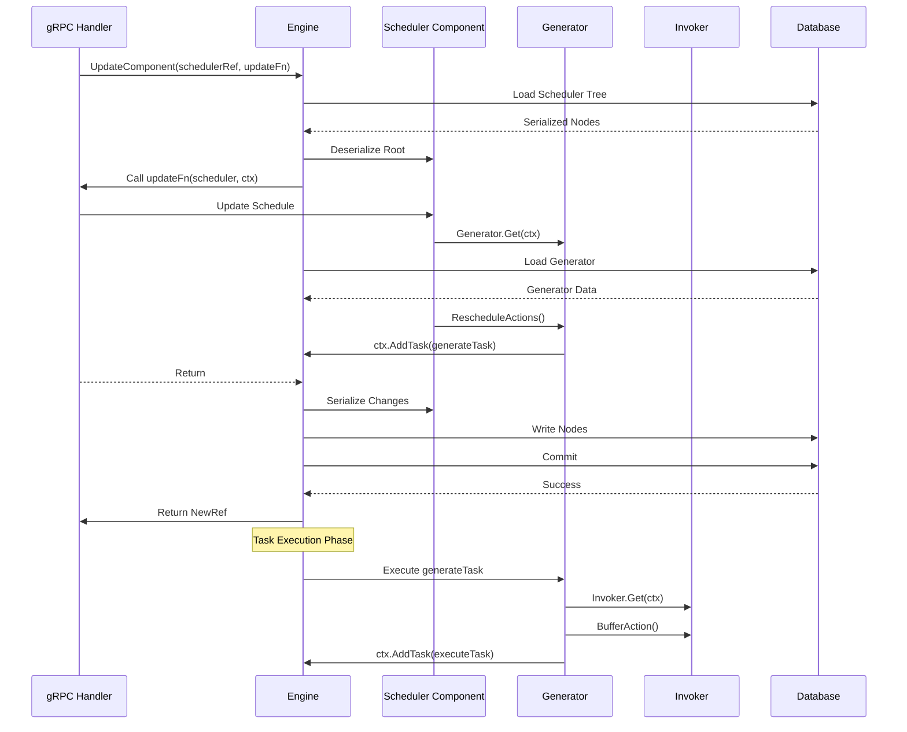

---

## Summary

CHASM provides a robust framework for building stateful, durable components within Temporal Server. Key takeaways:

1. **Type Safety**: Strong typing throughout with generic APIs
2. **Tree Structure**: Components organized hierarchically with lazy loading
3. **Transactional**: All state changes are atomic and consistent
4. **Task-Driven**: Event processing through pure and side-effect tasks
5. **Modular**: Libraries package related components and functionality
6. **Extensible**: Easy to add new archetypes and behaviors

For implementing archetypes, see:
- [`lib/README.md`](lib/README.md) - Archetype implementation guide
- [`lib/scheduler/README.md`](lib/scheduler/README.md) - Scheduler example

For framework code, explore:
- `engine.go` - Core Engine implementation
- `component.go` - Component interface
- `field.go` - Field system
- `statemachine.go` - State machine support
- `task.go` - Task interfaces
- `library.go` - Library interface
- `registry.go` - Component/task registration
