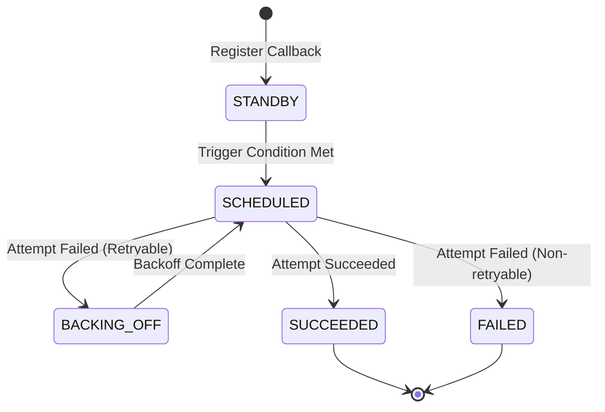
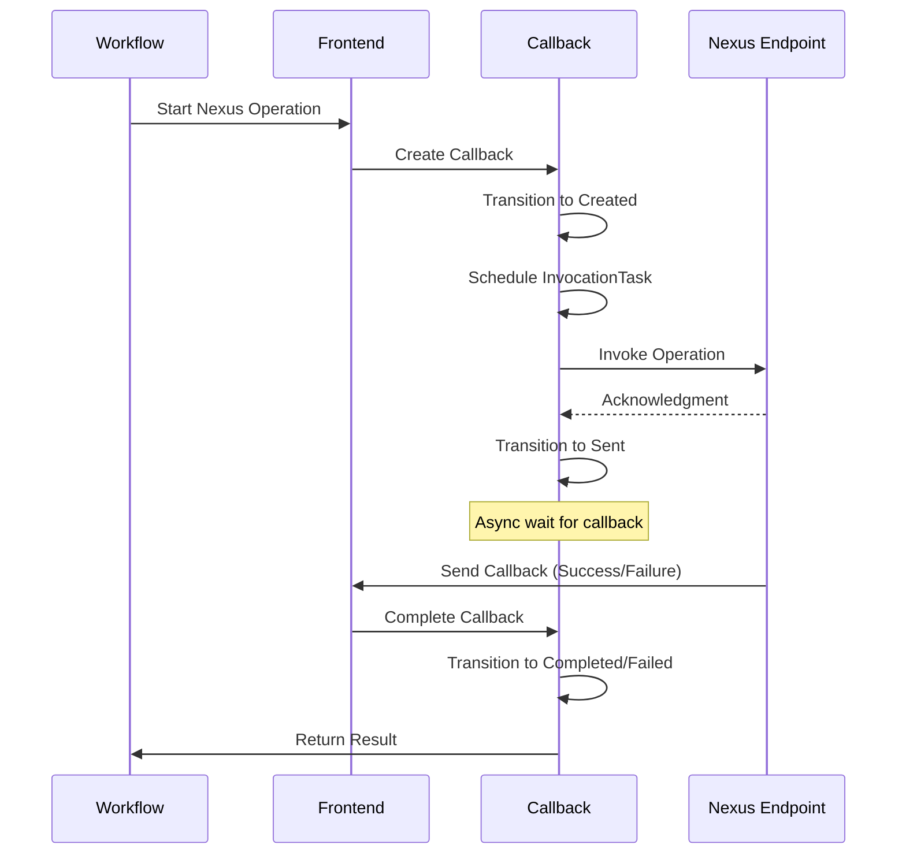

# Callback Archetype

The Callback archetype manages asynchronous callback handling for Nexus operations in Temporal Server using the CHASM framework. It tracks operation lifecycle, handles timeouts, and processes completion callbacks.

## Prerequisites

This document assumes familiarity with CHASM concepts. See [../../README.md](../../README.md) for:
- [Component architecture](../../README.md#component) and [Field[T] types](../../README.md#field-system-and-tree-structure)
- [Pure vs Side-Effect Tasks](../../README.md#task-system)
- [MutableContext](../../README.md#mutablecontext-interface) and state transitions
- [State machines](../../README.md#state-machines-and-transitions) and transitions
- [Library architecture](../../README.md#library-and-registry-architecture) and registration

## Overview

The Callback archetype enables Temporal to handle asynchronous Nexus operation callbacks with:

- **Operation Tracking**: Monitor pending Nexus operations
- **Timeout Management**: Handle operation and callback timeouts
- **Retry Logic**: Exponential backoff for failed invocations
- **Result Processing**: Handle success and failure completion callbacks
- **State Machine**: Track operation lifecycle through well-defined states

**Archetype Name**: `callback.callback`

## Component Architecture

The Callback archetype uses a single-component structure:

```
Callback (root)
└── CallbackState (embedded)
    ├── operation_info
    ├── invocation_state
    ├── timeout_info
    └── result_info
```

Unlike the Scheduler archetype which has multiple sub-components, Callback is implemented as a single [component](../../README.md#component) with an embedded [state machine](../../README.md#state-machines-and-transitions).

## Callback Component

The Callback component tracks a single asynchronous Nexus operation from initiation to completion.

### Responsibilities

1. **Invocation Management**: Track outbound Nexus operation calls
2. **Timeout Tracking**: Monitor operation and callback timeouts
3. **Retry Handling**: Implement exponential backoff for failures
4. **Result Processing**: Handle completion (success or failure)
5. **State Transitions**: Move through operation lifecycle states

### State

```protobuf
message CallbackState {
    // Information on how this callback should be invoked (e.g. its URL and type)
    Callback callback = 1;
    
    // The time when the callback was registered
    google.protobuf.Timestamp registration_time = 3;
    
    // Current status in the state machine
    CallbackStatus status = 4;
    
    // The number of attempts made to deliver the callback
    // This represents a minimum bound since attempt is incremented after request completes
    int32 attempt = 5;
    
    // The time when the last attempt completed
    google.protobuf.Timestamp last_attempt_complete_time = 6;
    
    // The last attempt's failure, if any
    temporal.api.failure.v1.Failure last_attempt_failure = 7;
    
    // The time when the next attempt is scheduled (only set during BACKING_OFF)
    google.protobuf.Timestamp next_attempt_schedule_time = 8;
    
    // Request ID that added the callback
    string request_id = 9;
}

message Callback {
    message Nexus {
        // Callback URL
        string url = 1;
        // Headers to attach to callback request
        map<string, string> header = 2;
    }
    
    oneof variant {
        Nexus nexus = 2;
    }
    
    repeated temporal.api.common.v1.Link links = 100;
}

enum CallbackStatus {
    CALLBACK_STATUS_UNSPECIFIED = 0;   // Default value, unspecified state
    CALLBACK_STATUS_STANDBY = 1;        // Waiting to be triggered
    CALLBACK_STATUS_SCHEDULED = 2;      // Queued or executing
    CALLBACK_STATUS_BACKING_OFF = 3;    // Retryable failure, waiting for backoff
    CALLBACK_STATUS_FAILED = 4;         // Permanent failure
    CALLBACK_STATUS_SUCCEEDED = 5;      // Successfully delivered
}
```

## State Machine

The Callback component implements a [state machine](../../README.md#state-machines-and-transitions) to track callback lifecycle from registration through completion or failure.



### States

**STANDBY**
- Initial state after callback is registered
- Waiting for trigger condition to be met (e.g., workflow closed)
- No invocation attempts have been made

**SCHEDULED**
- Callback is queued for execution or currently being invoked
- InvocationTask is scheduled or executing
- Attempt is in progress to deliver the callback

**BACKING_OFF**
- Previous invocation attempt failed with a retryable error
- Waiting for backoff period before next retry attempt
- `next_attempt_schedule_time` is set
- BackoffTask is scheduled to transition back to SCHEDULED

**SUCCEEDED**
- Callback successfully delivered
- Terminal state
- `last_attempt_complete_time` records completion

**FAILED**
- Callback failed with non-retryable error
- Terminal state
- `last_attempt_failure` contains error details

### Transitions

Transitions are implemented in `statemachine.go` using CHASM's `Transition` type:

#### TransitionScheduled
**Event**: `EventScheduled{}`  
**From**: `STANDBY`  
**To**: `SCHEDULED`

Triggered when the callback's trigger condition is met (e.g., workflow closes).

[embedmd]:# (statemachine.go go /var TransitionScheduled/ /^\)/)
```go
var TransitionScheduled = chasm.NewTransition(
	[]callbackspb.CallbackStatus{callbackspb.CALLBACK_STATUS_STANDBY},
	callbackspb.CALLBACK_STATUS_SCHEDULED,
	func(cb *Callback, ctx chasm.MutableContext, event EventScheduled) error {
		u, err := url.Parse(cb.Callback.GetNexus().GetUrl())
		if err != nil {
			return fmt.Errorf("failed to parse URL: %v: %w", cb.Callback, err)
		}
		ctx.AddTask(cb, chasm.TaskAttributes{Destination: u.Scheme + "://" + u.Host}, &callbackspb.InvocationTask{})
		return nil
	},
)
```

#### TransitionAttemptFailed
**Event**: `EventAttemptFailed{Time, Err, RetryPolicy}`  
**From**: `SCHEDULED`  
**To**: `BACKING_OFF`

Triggered when an invocation attempt fails with a retryable error.

[embedmd]:# (statemachine.go go /var TransitionAttemptFailed/ /^\)/)
```go
var TransitionAttemptFailed = chasm.NewTransition(
	[]callbackspb.CallbackStatus{callbackspb.CALLBACK_STATUS_SCHEDULED},
	callbackspb.CALLBACK_STATUS_BACKING_OFF,
	func(cb *Callback, ctx chasm.MutableContext, event EventAttemptFailed) error {
		cb.recordAttempt(event.Time)
		// Use 0 for elapsed time as we don't limit the retry by time (for now).
		nextDelay := event.RetryPolicy.ComputeNextDelay(0, int(cb.Attempt), event.Err)
		nextAttemptScheduleTime := event.Time.Add(nextDelay)
		cb.NextAttemptScheduleTime = timestamppb.New(nextAttemptScheduleTime)
		cb.LastAttemptFailure = &failurepb.Failure{
			Message: event.Err.Error(),
			FailureInfo: &failurepb.Failure_ApplicationFailureInfo{
				ApplicationFailureInfo: &failurepb.ApplicationFailureInfo{
					NonRetryable: false,
				},
			},
		}
		ctx.AddTask(
			cb,
			chasm.TaskAttributes{ScheduledTime: nextAttemptScheduleTime},
			&callbackspb.BackoffTask{Attempt: cb.Attempt},
		)
		return nil
	},
)
```

#### TransitionRescheduled
**Event**: `EventRescheduled{}`  
**From**: `BACKING_OFF`  
**To**: `SCHEDULED`

Triggered when backoff period completes and callback is ready to retry.

[embedmd]:# (statemachine.go go /var TransitionRescheduled/ /^\)/)
```go
var TransitionRescheduled = chasm.NewTransition(
	[]callbackspb.CallbackStatus{callbackspb.CALLBACK_STATUS_BACKING_OFF},
	callbackspb.CALLBACK_STATUS_SCHEDULED,
	func(cb *Callback, ctx chasm.MutableContext, event EventRescheduled) error {
		cb.NextAttemptScheduleTime = nil
		u, err := url.Parse(cb.Callback.GetNexus().Url)
		if err != nil {
			return fmt.Errorf("failed to parse URL: %v: %w", cb.Callback, err)
		}
		ctx.AddTask(
			cb,
			chasm.TaskAttributes{Destination: u.Scheme + "://" + u.Host},
			&callbackspb.InvocationTask{Attempt: cb.Attempt},
		)
		return nil
	},
)
```

#### TransitionSucceeded
**Event**: `EventSucceeded{Time}`  
**From**: `SCHEDULED`  
**To**: `SUCCEEDED`

Triggered when callback is successfully delivered.

[embedmd]:# (statemachine.go go /var TransitionSucceeded/ /^\)/)
```go
var TransitionSucceeded = chasm.NewTransition(
	[]callbackspb.CallbackStatus{callbackspb.CALLBACK_STATUS_SCHEDULED},
	callbackspb.CALLBACK_STATUS_SUCCEEDED,
	func(cb *Callback, ctx chasm.MutableContext, event EventSucceeded) error {
		cb.recordAttempt(event.Time)
		cb.LastAttemptFailure = nil
		return nil
	},
)
```

#### TransitionFailed
**Event**: `EventFailed{Time, Err}`  
**From**: `SCHEDULED`  
**To**: `FAILED`

Triggered when callback fails with a non-retryable error.

[embedmd]:# (statemachine.go go /var TransitionFailed/ /^\)/)
```go
var TransitionFailed = chasm.NewTransition(
	[]callbackspb.CallbackStatus{callbackspb.CALLBACK_STATUS_SCHEDULED},
	callbackspb.CALLBACK_STATUS_FAILED,
	func(cb *Callback, ctx chasm.MutableContext, event EventFailed) error {
		cb.recordAttempt(event.Time)
		cb.LastAttemptFailure = &failurepb.Failure{
			Message: event.Err.Error(),
			FailureInfo: &failurepb.Failure_ApplicationFailureInfo{
				ApplicationFailureInfo: &failurepb.ApplicationFailureInfo{
					NonRetryable: true,
				},
			},
		}
		return nil
	},
)
```

## Tasks

### InvocationTask

**Type**: [Side-Effect Task](../../README.md#side-effect-tasks)  
**Purpose**: Invoke Nexus operation endpoint

**Execution Flow**:
1. Validate callback is in appropriate state
2. Call Nexus endpoint with operation request
3. Handle response:
   - Success: Transition to Sent state
   - Retriable error: Transition to Retrying state
   - Non-retriable error: Transition to Failed state
4. Schedule timeout check or retry task

**Implementation**:
```go
type InvocationTaskExecutor struct {
    nexusClient nexus.Client
    logger log.Logger
}

func (e *InvocationTaskExecutor) Execute(
    ctx context.Context,
    ref chasm.ComponentRef,
    attrs chasm.TaskAttributes,
    task *callbackpb.InvocationTask,
) error {
    // Call Nexus endpoint
    result, err := e.nexusClient.InvokeOperation(ctx, task.Endpoint, task.Operation, task.Payload)
    if err != nil {
        return e.handleInvocationError(ctx, ref, err)
    }
    
    // Update callback state
    _, _, err = chasm.UpdateComponent(
        ctx,
        ref,
        func(c *Callback, ctx chasm.MutableContext, input struct{}) (struct{}, error) {
            return struct{}{}, c.HandleInvocationComplete(ctx, result)
        },
        struct{}{},
    )
    
    return err
}
```

### BackoffTask

**Type**: [Pure Task](../../README.md#pure-tasks)  
**Purpose**: Implement retry with exponential backoff

**Execution Flow**:
1. Check if retry is still valid (not timed out)
2. Calculate backoff duration based on attempt number
3. Wait for backoff period (via scheduled time)
4. Transition back to Invoking state
5. Schedule new InvocationTask

**Backoff Calculation**:
```go
func calculateBackoff(attempt int32, baseDelay time.Duration, maxDelay time.Duration) time.Duration {
    // Exponential backoff: base * 2^attempt
    delay := baseDelay * time.Duration(1<<uint(attempt))
    if delay > maxDelay {
        delay = maxDelay
    }
    // Add jitter to prevent thundering herd
    jitter := time.Duration(rand.Int63n(int64(delay / 10)))
    return delay + jitter
}
```

## API Integration

The Callback archetype integrates with Nexus operations through the Temporal frontend API:

### Creating a Callback

```go
// When starting a Nexus operation
operationID := uuid.New().String()

_, executionKey, ref, err := chasm.NewExecution( // See: ../../README.md#engine-interface
    chasm.NewEngineContext(ctx, engine),
    chasm.ExecutionKey{
        NamespaceID: namespaceID,
        BusinessID:  operationID,
    },
    func(ctx chasm.MutableContext, input CreateCallbackRequest) (*Callback, CreateCallbackResponse, error) {
        callback := NewCallback(
            ctx,
            input.OperationID,
            input.Endpoint,
            input.Service,
            input.Operation,
            input.Payload,
            input.OperationTimeout,
            input.CallbackTimeout,
        )
        return callback, CreateCallbackResponse{OperationID: operationID}, nil
    },
    request,
)
```

### Completing a Callback

```go
// When callback is received from Nexus endpoint
_, _, err := chasm.UpdateComponent( // See: ../../README.md#engine-interface
    chasm.NewEngineContext(ctx, engine),
    ref,
    func(c *Callback, ctx chasm.MutableContext, input CompleteCallbackRequest) (CompleteCallbackResponse, error) {
        if input.Success != nil {
            err := c.HandleSuccess(ctx, input.Success.Payload)
            return CompleteCallbackResponse{}, err
        } else {
            err := c.HandleFailure(ctx, input.Failure)
            return CompleteCallbackResponse{}, err
        }
    },
    request,
)
```

## Configuration

Callback configuration is defined in `config.go`:

```go
type Config struct {
    // Retry configuration
    MaxAttempts      int
    InitialInterval  time.Duration
    BackoffCoefficient float64
    MaxInterval      time.Duration
    
    // Timeout configuration
    DefaultOperationTimeout time.Duration
    DefaultCallbackTimeout  time.Duration
}
```

## Component Lifecycle



## Error Handling

### Invocation Errors

**Retriable Errors**:
- Network timeouts
- Temporary service unavailability
- Rate limiting

Action: Transition to Retrying state, schedule BackoffTask

**Non-Retriable Errors**:
- Invalid operation name
- Authentication failure
- Malformed request

Action: Transition to Failed state immediately

### Timeouts

**Operation Timeout**:
- Exceeded time for operation to complete
- Includes invocation time + processing time
- Action: Transition to TimedOut state

**Callback Timeout**:
- Exceeded time waiting for callback after successful invocation
- Action: Transition to TimedOut state

## Testing

Test files:
- `statemachine_test.go` - State machine transitions
- `executors_test.go` - Task executor tests
- `config_test.go` - Configuration validation

Run tests:
```bash
make unit-test
```

## Implementation Files

- `library.go` - Library registration
- `component.go` - Callback component
- `statemachine.go` - State machine transitions
- `executors.go` - Task executors (InvocationTaskExecutor, BackoffTaskExecutor)
- `chasm_invocation.go` - CHASM-specific invocation logic
- `nexus_invocation.go` - Nexus client integration
- `request.go` - Request/response structures
- `config.go` - Configuration
- `metrics.go` - Metrics definitions
- `fx.go` - Dependency injection

## Usage Example

```go
// Initialize callback for async Nexus operation
callback := NewCallback(
    ctx,
    "operation-123",
    "https://nexus.example.com",
    "my-service",
    "process-data",
    payload,
    30*time.Minute,  // operation timeout
    5*time.Minute,   // callback timeout
)

// Start invocation
if err := callback.StartInvocation(ctx); err != nil {
    return err
}

// Later, when callback is received...
if successPayload != nil {
    callback.HandleSuccess(ctx, successPayload)
} else {
    callback.HandleFailure(ctx, failure)
}
```

---

For more information on the CHASM framework, see [`../../README.md`](../../README.md).

---

## Documentation Maintenance

This README uses [embedmd](https://github.com/campoy/embedmd) to keep code examples in sync with actual source files.

### For Contributors

**When updating code:**
1. Make your code changes in `statemachine.go`, `executors.go`, etc.
2. Run `make docs-embed` to update embedded snippets in this README
3. Commit both code and documentation changes together

**Important:** You must manually run `make docs-embed` before committing. The pre-commit hook does not automatically update documentation.

**CI checks:** Pull requests that modify chasm files will fail CI if documentation is out of sync. Run `make docs-embed` to fix.

### How It Works

Code snippets marked with `[embedmd]:# (file.go go /pattern/ /end/)` are automatically extracted from source files:

```markdown
[embedmd]:# (statemachine.go go /var TransitionScheduled/ /^\)/)
```

This extracts the `TransitionScheduled` definition from `statemachine.go` and keeps it current.

**Benefits:**
- Examples are always accurate - they're the actual production code
- No manual copy/paste of code into docs
- Documentation stays fresh as code evolves
- CI catches stale docs before merge
