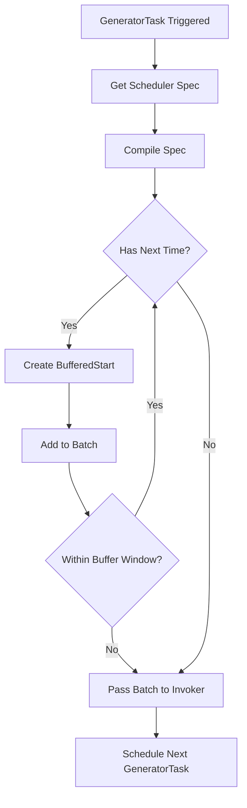
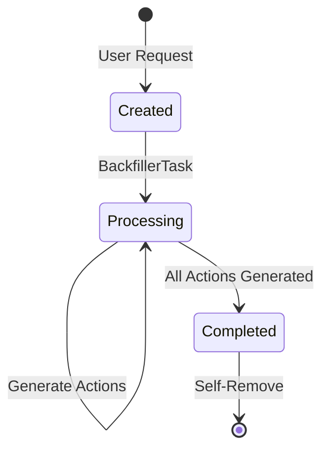
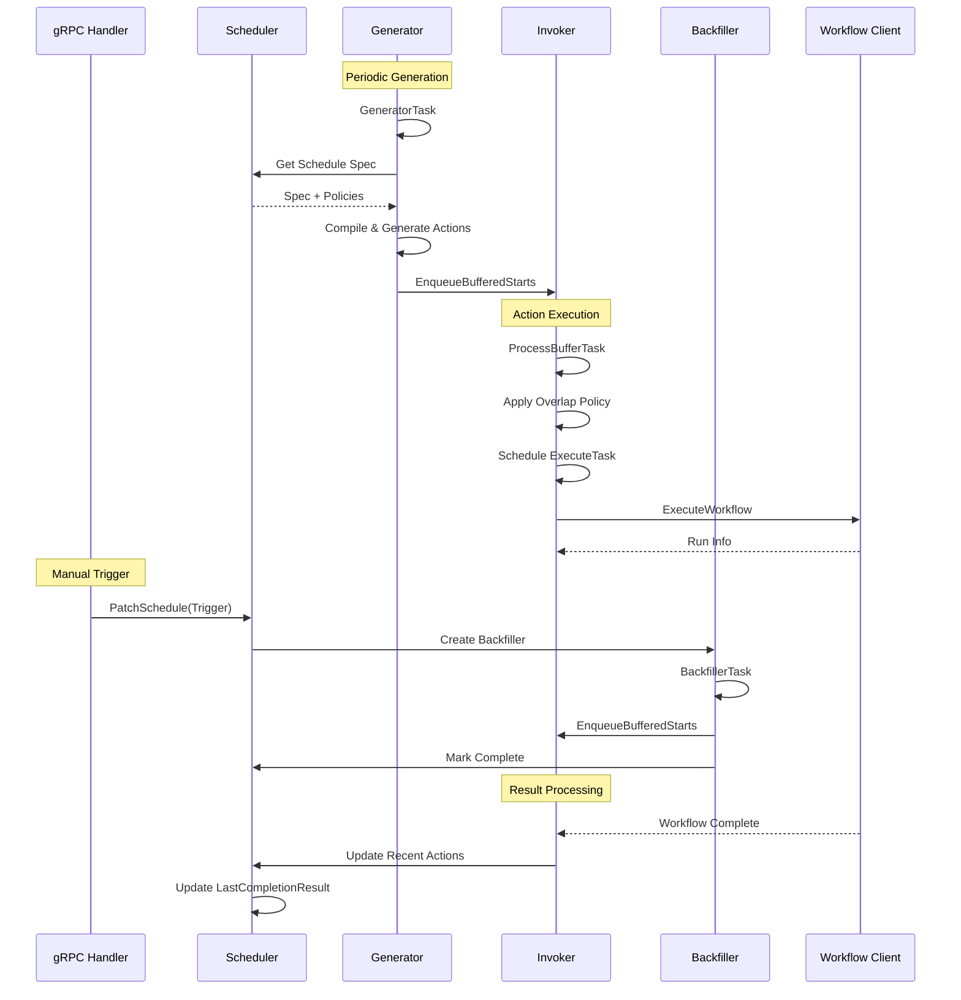

# Scheduler Archetype

The Scheduler archetype implements schedule-based workflow execution in Temporal Server using the CHASM framework. It provides cron-based scheduling, calendar-based scheduling, manual triggers, and backfill capabilities.

## Prerequisites

This document assumes familiarity with CHASM concepts. See [../../README.md](../../README.md) for:
- [Component architecture](../../README.md#component) and [Field[T] types](../../README.md#field-system)
- [Pure vs Side-Effect Tasks](../../README.md#task-system)
- [MutableContext](../../README.md#mutablecontext) and state transitions
- [State machines](../../README.md#state-machines) and transitions
- [Library architecture](../../README.md#library-architecture) and registration

## Overview

The Scheduler archetype enables users to execute workflows on a defined schedule with features including:

- **Schedule Specifications**: Cron expressions, calendar intervals, and structured calendars
- **Automated Execution**: Workflows start automatically according to the schedule
- **Manual Triggers**: Immediate workflow execution on demand
- **Backfills**: Execute workflows for past time ranges
- **Result Tracking**: Monitor workflow outcomes and handle failures
- **Pause/Resume**: Temporarily suspend and resume scheduling
- **Conflict Policies**: Configure behavior when scheduled time is missed

**Archetype Name**: `scheduler.scheduler`

## Component Tree Architecture

The Scheduler uses a multi-[component tree structure](../../README.md#tree-structure):

```
Scheduler (root)
├── LastCompletionResult (data)      # Most recent workflow result
├── Generator (component)             # Schedules actions per spec
│   └── GeneratorState (data)
├── Invoker (component)               # Executes buffered actions
│   └── InvokerState (data)
├── Backfillers (map)                 # Manual triggers and backfills
│   ├── [backfill-id-1] → Backfiller
│   │   └── BackfillerState (data)
│   └── [backfill-id-2] → Backfiller
│       └── BackfillerState (data)
└── Visibility (component)            # Search attributes and memo
```

### Component Responsibilities

**Scheduler** (Root Component)
- Maintains schedule specification and policies
- Tracks recent workflow executions
- Manages schedule lifecycle (open/closed, paused/running)
- Coordinates between Generator, Invoker, and Backfillers

**Generator**
- Processes schedule specification (cron, calendar)
- Buffers future actions according to the schedule
- Reschedules when specification changes
- Generates actions up to a buffering horizon

**Invoker**
- Executes buffered workflow starts
- Tracks in-flight workflows
- Processes workflow completion events
- Handles overlap policies (skip, buffer, allow-all, etc.)

**Backfiller**
- Handles manual trigger requests
- Processes backfill time ranges
- One Backfiller instance per manual request
- Removed after completing its backfill

## Generator Component

The Generator component buffers scheduled actions according to the schedule specification.

### Responsibilities

1. **Parse Schedule Spec**: Interpret cron expressions and calendar definitions
2. **Generate Actions**: Create buffered actions for upcoming scheduled times
3. **Buffer Management**: Maintain actions within buffering window
4. **Spec Changes**: Regenerate actions when schedule is updated

### State

```protobuf
message GeneratorState {
    google.protobuf.Timestamp last_processed_time = 1;
}
```

### Tasks

**GeneratorTask** ([Pure Task](../../README.md#pure-tasks))
- Processes schedule specification
- Generates actions up to buffer horizon
- Hands off buffered starts to Invoker
- Reschedules itself for next generation cycle

### Behavior



## Invoker Component

The Invoker component executes buffered workflow starts and tracks their completion.

### Responsibilities

1. **Execute Workflows**: Start workflows from the buffer
2. **Track In-Flight**: Monitor pending workflow executions
3. **Handle Completion**: Process workflow results (success/failure)
4. **Apply Policies**: Enforce overlap and catchup policies

### State

```protobuf
message InvokerState {
    repeated BufferedStart buffered_starts = 1;
    map<string, string> request_id_to_workflow_id = 2;
    repeated RunningWorkflow running_workflows = 3;
}
```

### Tasks

**InvokerExecuteTask** ([Side-Effect Task](../../README.md#side-effect-tasks))
- Starts workflows via Temporal client
- Uses request IDs for idempotency
- Updates state with workflow run information

**InvokerProcessBufferTask** ([Pure Task](../../README.md#pure-tasks))
- Processes buffered starts
- Applies overlap policies
- Schedules InvokerExecuteTask for each start

**InvokerIdleTask** (Pure Task)
- Polls for workflow completions
- Updates recent actions list
- Cleans up completed workflows

### Overlap Policies

- **Skip**: Skip if previous workflow still running
- **Buffer All**: Queue all starts for later execution  
- **Buffer One**: Keep only one pending start
- **Cancel Other**: Terminate previous workflow and start new
- **Terminate Other**: Force-terminate previous and start new
- **Allow All**: Start new workflow regardless of previous state

## Backfiller Component

Each Backfiller handles one manual trigger or backfill request.

### Responsibilities

1. **Immediate Triggers**: Execute workflow immediately on request
2. **Time Range Backfills**: Generate actions for past time range
3. **Self-Cleanup**: Remove itself after completion

### State

```protobuf
message BackfillerState {
    string backfill_id = 1;
    google.protobuf.Timestamp last_processed_time = 2;
    bool completed = 3;
    
    oneof request {
        TriggerImmediatelyRequest trigger_request = 4;
        BackfillRequest backfill_request = 5;
    }
}
```

### Tasks

**BackfillerTask** ([Pure Task](../../README.md#pure-tasks))
- Processes backfill request
- Generates buffered starts for time range
- Passes starts to Invoker
- Marks itself complete when done

### Lifecycle



## Schedule Policies

Scheduler behavior is controlled by several policies defined in the schedule specification. These policies determine how the scheduler handles various edge cases and operational scenarios.

### Overlap Policy

Controls what happens when a scheduled workflow should start while a previous workflow is still running.

| Policy | Behavior | Use Case |
|--------|----------|----------|
| **SKIP** | Skip new start if previous workflow running | Avoid duplicate work, sequential processing |
| **BUFFER_ALL** | Queue all missed starts for later execution | Ensure all scheduled times are executed |
| **BUFFER_ONE** | Keep only one pending start in queue | Execute latest missed time once previous completes |
| **CANCEL_OTHER** | Cancel previous workflow, start new one | Latest execution is most important |
| **TERMINATE_OTHER** | Force-terminate previous, start new | Urgent execution, discard old work |
| **ALLOW_ALL** | Start new workflow regardless of state | Independent parallel executions |

**Example:**
```go
Schedule: &schedulepb.Schedule{
    Policies: &schedulepb.SchedulePolicies{
        OverlapPolicy: schedulepb.ScheduleOverlapPolicy_SKIP,
    },
}
```

**Implementation:** The Invoker component applies overlap policies in `InvokerProcessBufferTask` by checking `RunningWorkflows` state before starting new workflows.

### Catchup Window

Defines how far in the past the scheduler will execute missed actions after downtime or delays.

**Purpose:**
- Prevent executing stale scheduled times after service downtime
- Control backlog processing when scheduler catches up
- Balance completeness vs recency of execution

**Behavior:**
```go
catchupWindow := schedule.Policies.CatchupWindow.AsDuration()
now := ctx.Now(scheduler)

for _, bufferedStart := range invoker.BufferedStarts {
    scheduledTime := bufferedStart.NominalTime.AsTime()
    
    if now.Sub(scheduledTime) > catchupWindow {
        // Drop this start - outside catchup window
        result.MissedCatchupWindow++
        result.discardStarts = append(result.discardStarts, bufferedStart)
        continue
    }
    
    // Execute this start
    result.startWorkflows = append(result.startWorkflows, bufferedStart)
}
```

**Example:**
```go
Policies: &schedulepb.SchedulePolicies{
    CatchupWindow: durationpb.New(1 * time.Hour),
}
// Only execute scheduled times from the last hour
// Drop older scheduled times when catching up
```

**Common Values:**
- `0` - No catchup, drop all missed times
- `1 hour` - Execute last hour of missed schedules
- `24 hours` - Execute last day of missed schedules
- `nil`/unset - Execute all missed times (unlimited catchup)

### Pause and Resume

Temporarily suspend and resume schedule execution without deleting the schedule.

**Paused Behavior:**
- Generator continues buffering future actions based on schedule spec
- Invoker does NOT start new workflows from buffered actions
- Existing running workflows continue to completion
- Schedule remains queryable and updatable

**State Changes:**
```go
// Pause schedule
func (s *Scheduler) Update(ctx chasm.MutableContext, req *UpdateScheduleRequest) (*UpdateScheduleResponse, error) {
    if req.Schedule.State.Paused {
        s.Schedule.State.Paused = true
        // Invoker will check Paused state and skip execution
    }
    return &UpdateScheduleResponse{}, nil
}
```

**Implementation Details:**
- Pause state is checked in `InvokerProcessBufferTask` before starting workflows
- BufferedStarts accumulate during pause
- On resume, buffered starts execute according to overlap and catchup policies
- No tasks are invalidated - they're simply not processed while paused

**Use Cases:**
- Maintenance windows
- Temporary suspension during incidents
- Conditional execution based on external factors

### Conflict Token

Optimistic concurrency control mechanism to prevent conflicting concurrent updates.

**Purpose:**
- Ensure schedule updates are based on latest state
- Prevent lost updates from concurrent modifications
- Detect when schedule was modified between read and update

**Mechanism:**
```go
type Scheduler struct {
    ConflictToken int64  // Incremented on each mutation
    cacheConflictToken int64  // Cached for validation
}

func (s *Scheduler) Update(ctx chasm.MutableContext, req *UpdateScheduleRequest) (*UpdateScheduleResponse, error) {
    // Validate conflict token
    if req.ConflictToken != s.ConflictToken {
        return nil, ErrConflictTokenMismatch
    }
    
    // Perform update
    s.Schedule = req.Schedule
    
    // Increment token
    s.ConflictToken++
    
    return &UpdateScheduleResponse{
        ConflictToken: s.ConflictToken,
    }, nil
}
```

**Client Pattern:**
```go
// 1. Describe to get current state and conflict token
descResp, err := client.DescribeSchedule(ctx, &DescribeScheduleRequest{
    ScheduleId: "my-schedule",
})

// 2. Modify schedule
schedule := descResp.Schedule
schedule.Spec.CronString = []string{"0 0 * * *"}

// 3. Update with conflict token from describe
updateResp, err := client.UpdateSchedule(ctx, &UpdateScheduleRequest{
    ScheduleId:    "my-schedule",
    Schedule:      schedule,
    ConflictToken: descResp.ConflictToken,  // Must match current token
})

if err == ErrConflictTokenMismatch {
    // Schedule was modified by another client, retry from step 1
}
```

**Token Behavior:**
- Initialized to `InitialConflictToken` on schedule creation
- Incremented on every `Update`, `Patch`, or state-modifying operation
- Returned in all response messages for subsequent updates
- Validated before applying updates to prevent lost writes

### Timeout Handling

The Scheduler doesn't implement explicit timeouts at the schedule level. Workflow-level timeouts are handled by:

1. **Workflow Execution Timeouts**: Configured in `WorkflowExecutionInfo`
2. **Schedule Run Timeouts**: Configured in `ScheduleOptions`
3. **Workflow Failure**: Tracked in `RecentActions` and `LastCompletionResult`

**Timeout Tracking:**
```go
type RunningWorkflow struct {
    WorkflowID string
    RunID      string
    StartTime  *timestamppb.Timestamp
}

// Invoker tracks running workflows
type InvokerState struct {
    RunningWorkflows []*RunningWorkflow
}
```

When a workflow times out:
- Temporal sends completion event to Invoker
- Invoker processes completion via workflow completion callback
- Failure is recorded in `RecentActions` with timeout details
- Overlap policy determines if next scheduled time should execute

## State Machines and Transitions

The Scheduler doesn't use explicit [state machine](../../README.md#state-machines) transitions but manages state through:

### Schedule States

- **Running**: Normal operation, generating and executing workflows
- **Paused**: Temporarily suspended, no new workflows started
- **Closed**: Permanently stopped, no further operations

### Generator States

- **Idle**: Waiting for next generation cycle
- **Generating**: Actively processing schedule spec
- **Rescheduling**: Regenerating after spec change

### Invoker States  

- **Processing Buffer**: Executing buffered starts
- **Idle**: No pending starts, waiting for completions
- **Handling Completion**: Processing workflow result

## Task Executors

### SchedulerIdleTask

**Type**: Pure Task  
**Component**: Scheduler  
**Purpose**: Periodic maintenance and state synchronization

### GeneratorTask

**Type**: Pure Task  
**Component**: Generator  
**Purpose**: Generate scheduled actions

**Execution Flow**:
1. Get compiled schedule specification
2. Iterate from `last_processed_time` to buffer horizon
3. Generate BufferedStart for each scheduled time
4. Pass batch to Invoker
5. Update `last_processed_time`
6. Reschedule for next cycle

### InvokerExecuteTask

**Type**: Side-Effect Task  
**Component**: Invoker  
**Purpose**: Start workflows via Temporal client

**Execution Flow**:
1. Receive BufferedStart from buffer
2. Call workflow client with StartWorkflowOptions
3. Use request ID for idempotency
4. Update state with workflow run info
5. Handle errors (conflicts, validation failures)

### InvokerProcessBufferTask

**Type**: Pure Task  
**Component**: Invoker  
**Purpose**: Process buffered starts and schedule executions

**Execution Flow**:
1. Get next BufferedStart from buffer
2. Apply overlap policy
3. Apply catchup window policy
4. Schedule InvokerExecuteTask if allowed
5. Reschedule if more buffered starts remain

### BackfillerTask

**Type**: Pure Task  
**Component**: Backfiller  
**Purpose**: Generate actions for manual requests

**Execution Flow**:
1. Check request type (trigger vs backfill)
2. For trigger: Generate single immediate action
3. For backfill: Iterate over time range
4. Pass BufferedStarts to Invoker
5. Mark Backfiller as completed
6. Schedule self-removal

## API and Service Definitions

The Scheduler exposes a gRPC service defined in `proto/v1/service.proto`:

### Key Operations

**CreateSchedule**
```protobuf
rpc CreateSchedule(CreateScheduleRequest) returns (CreateScheduleResponse);
```
Creates a new scheduler execution.

**UpdateSchedule**
```protobuf
rpc UpdateSchedule(UpdateScheduleRequest) returns (UpdateScheduleResponse);
```
Updates schedule specification or state (pause/unpause).

**PatchSchedule**
```protobuf
rpc PatchSchedule(PatchScheduleRequest) returns (PatchScheduleResponse);
```
Applies patches like trigger immediately or add backfill.

**DescribeSchedule**
```protobuf
rpc DescribeSchedule(DescribeScheduleRequest) returns (DescribeScheduleResponse);
```
Returns current schedule state and recent actions.

**DeleteSchedule**
```protobuf
rpc DeleteSchedule(DeleteScheduleRequest) returns (DeleteScheduleResponse);
```
Closes the scheduler execution.

### Handler Implementation

The handler (`handler.go`) implements these operations using the CHASM Engine.

**Handler Structure:**

[embedmd]:# (handler.go go /type handler struct/ /^}/)
```go
type handler struct {
	schedulerpb.UnimplementedSchedulerServiceServer
}
```

**Update Pattern** - Uses [`chasm.UpdateComponent`](../../README.md#updatecomponent) with method reference:

[embedmd]:# (handler.go go /func \(h \*handler\) UpdateSchedule/ /^}/)
```go
func (h *handler) UpdateSchedule(ctx context.Context, req *schedulerpb.UpdateScheduleRequest) (*schedulerpb.UpdateScheduleResponse, error) {
	resp, _, err := chasm.UpdateComponent(
		ctx,
		chasm.NewComponentRef[*Scheduler](
			chasm.ExecutionKey{
				NamespaceID: req.NamespaceId,
				BusinessID:  req.FrontendRequest.ScheduleId,
			},
		),
		(*Scheduler).Update,
		req,
	)
	return resp, err
}
```

**Create Pattern** - Uses [`chasm.NewExecution`](../../README.md#newexecution) with constructor:

[embedmd]:# (handler.go go /func \(h \*handler\) CreateSchedule/ /^}/)
```go
func (h *handler) CreateSchedule(ctx context.Context, req *schedulerpb.CreateScheduleRequest) (*schedulerpb.CreateScheduleResponse, error) {
	resp, _, _, err := chasm.NewExecution(
		ctx,
		chasm.ExecutionKey{
			NamespaceID: req.NamespaceId,
			BusinessID:  req.FrontendRequest.ScheduleId,
		},
		CreateScheduler,
		req,
		chasm.WithRequestID(req.FrontendRequest.RequestId),
	)
	return resp, err
}
```

**Read Pattern** - Uses [`chasm.ReadComponent`](../../README.md#readcomponent) for read-only access:

[embedmd]:# (handler.go go /func \(h \*handler\) DescribeSchedule/ /^}/)
```go
func (h *handler) DescribeSchedule(ctx context.Context, req *schedulerpb.DescribeScheduleRequest) (*schedulerpb.DescribeScheduleResponse, error) {
	return chasm.ReadComponent(
		ctx,
		chasm.NewComponentRef[*Scheduler](
			chasm.ExecutionKey{
				NamespaceID: req.NamespaceId,
				BusinessID:  req.FrontendRequest.ScheduleId,
			},
		),
		(*Scheduler).Describe,
		req,
	)
}
```

**Key Pattern:** Handlers use **method references** (e.g., `(*Scheduler).Update`) rather than inline lambdas. This provides type safety and keeps handlers thin while business logic stays in components.

See [`handler.go`](handler.go) for the complete implementation including `PatchSchedule` and `DeleteSchedule`.

## Configuration

Scheduler configuration is defined in `config.go`:

```go
type Config struct {
    // Maximum number of actions to buffer
    MaxBufferSize int
    
    // How far ahead to generate actions
    BufferWindow time.Duration
    
    // Minimum interval between invocations
    MinInterval time.Duration
    
    // Maximum actions per backfill request
    BackfillsPerIteration int
}
```

## Component Interactions



## Usage Example

### Creating a Schedule

```go
// Create schedule with cron expression
schedule := &schedulepb.Schedule{
    Spec: &schedulepb.ScheduleSpec{
        Calendars: nil,
        CronString: []string{"0 0 * * *"}, // Daily at midnight
    },
    Action: &schedulepb.ScheduleAction{
        Action: &schedulepb.ScheduleAction_StartWorkflow{
            StartWorkflow: &workflowpb.NewWorkflowExecutionInfo{
                WorkflowId: "scheduled-workflow",
                WorkflowType: &commonpb.WorkflowType{
                    Name: "MyWorkflow",
                },
            },
        },
    },
    Policies: &schedulepb.SchedulePolicies{
        OverlapPolicy: schedulepb.ScheduleOverlapPolicy_SKIP,
        CatchupWindow: durationpb.New(time.Hour),
    },
}

resp, err := schedulerClient.CreateSchedule(ctx, &schedulerpb.CreateScheduleRequest{
    Namespace: "default",
    ScheduleId: "my-schedule",
    Schedule: schedule,
})
```

### Triggering Immediate Execution

```go
resp, err := schedulerClient.PatchSchedule(ctx, &schedulerpb.PatchScheduleRequest{
    ScheduleId: "my-schedule",
    Patch: &schedulepb.SchedulePatch{
        TriggerImmediately: &schedulepb.TriggerImmediatelyRequest{
            OverlapPolicy: schedulepb.ScheduleOverlapPolicy_ALLOW_ALL,
        },
    },
})
```

### Backfilling Time Range

```go
resp, err := schedulerClient.PatchSchedule(ctx, &schedulerpb.PatchScheduleRequest{
    ScheduleId: "my-schedule",
    Patch: &schedulepb.SchedulePatch{
        BackfillRequest: []*schedulepb.BackfillRequest{
            {
                StartTime: timestamppb.New(startTime),
                EndTime: timestamppb.New(endTime),
                OverlapPolicy: schedulepb.ScheduleOverlapPolicy_BUFFER_ALL,
            },
        },
    },
})
```

## Implementation Files

- `library.go` - Library registration with components and tasks
- `scheduler.go` - Scheduler root component
- `generator.go` - Generator component
- `invoker.go` - Invoker component  
- `backfiller.go` - Backfiller component
- `*_tasks.go` - Task executor implementations
- `handler.go` - gRPC service handler
- `config.go` - Configuration structures
- `spec_processor.go` - Schedule specification compilation
- `util.go` - Helper functions
- `fx.go` - Dependency injection setup

## Testing

Tests are organized by component and functionality:

- `scheduler_test.go` - Scheduler component tests
- `scheduler_suite_test.go` - Integration test suite
- `generator_tasks_test.go` - Generator task tests
- `invoker_*_test.go` - Invoker task tests
- `backfiller_tasks_test.go` - Backfiller task tests
- `spec_processor_test.go` - Spec compilation tests

Run tests:
```bash
make unit-test
```

---

For more information on the CHASM framework, see [`../../README.md`](../../README.md).

---

## Documentation Maintenance

This README uses [embedmd](https://github.com/campoy/embedmd) to keep code examples in sync with actual source files.

### For Contributors

**When updating code:**
1. Make your code changes in `handler.go`, `scheduler.go`, etc.
2. Run `make docs-embed` to update embedded snippets in this README
3. Commit both code and documentation changes together

**Important:** You must manually run `make docs-embed` before committing. The pre-commit hook does not automatically update documentation.

**CI checks:** Pull requests that modify chasm files will fail CI if documentation is out of sync. Run `make docs-embed` to fix.

### How It Works

Code snippets marked with `[embedmd]:# (file.go go /pattern/ /end/)` are automatically extracted from source files:

```markdown
[embedmd]:# (handler.go go /func \(h \*handler\) UpdateSchedule/ /^}/)
```

This extracts the `UpdateSchedule` function from `handler.go` and keeps it current.

**Benefits:**
- Examples are always accurate - they're the actual production code
- No manual copy/paste of code into docs
- Documentation stays fresh as code evolves
- CI catches stale docs before merge
