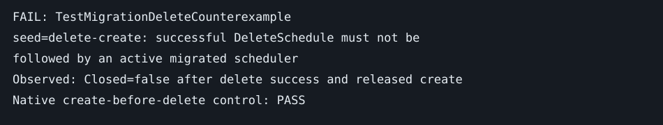

# Delete versus an in-flight forward create

Base: ad7b2298d. Fixed seed: `delete-create`, logical clock 2026-09-04T12:00:00Z.
Invariant: a successful schedule deletion cannot be followed by an active scheduler created from an older migration snapshot.

The deterministic test holds forward creation at a channel barrier. The real frontend `DeleteSchedule` executes its CHASM path against the real component engine, observes NotFound, then terminates the V1 workflow through a mocked History RPC. After deletion succeeds, the barrier releases the real `CreateSchedulerFromMigration` constructor and its CHASM transaction. The destination is active. The native control creates first, then deletes through the same frontend/component paths and observes a closed destination.

This is a component/ingress counterexample, not a full History persistence experiment. V1 termination is represented by a successful History RPC; the test does not run a live V1 worker, ambiguous database commits, or namespace failover. The forward service handler's only creation fence is the CHASM execution key and its existing-execution/sentinel handling. No state from the successful V1 delete is supplied to that creation transaction.

```mermaid
sequenceDiagram
    participant Create as Forward create
    participant Delete as DeleteSchedule
    participant CHASM
    participant V1
    Note over Create: held before CHASM creation
    Delete->>CHASM: delete
    CHASM-->>Delete: NotFound
    Delete->>V1: terminate
    V1-->>Delete: success
    Delete-->>Delete: return success
    Create->>CHASM: create from old snapshot
    CHASM-->>Create: active destination committed
```



Control: `go test -tags test_dep ./service/frontend -run '^TestMigrationDelete' -count=1`.
Counterexample: `TEMPORAL_RUN_MIGRATION_COUNTEREXAMPLES=1 go test -tags test_dep ./service/frontend -run '^TestMigrationDeleteCounterexample$' -count=1`.

Upstream audit: all public open PR titles and bodies fetched on 2026-09-04; no matching durable delete/incarnation fence found. #11924 changes sentinel classification, not this race.

Disposition: **no local production workaround**. Depend on [PR #44](https://github.com/chaptersix/temporal/pull/44)'s History ingress/incarnation protocol. Delete needs a replicated tombstone or generation advance in the same authoritative ownership protocol checked by migration creation. The generation must survive response loss, task retry, destination deletion/retention, and namespace failover. A second read before creation leaves exactly the same interleaving between that read and the write. A process-local lock or tombstone cannot fence failover or delayed RPCs.

Until that protocol exists, operators must stop forward-migration admission, reconcile ambiguous creates, and drain existing attempts before relying on deletion across backends. The existing API does not establish this fence. This is an explicit fail-closed operational disposition, not a claim that the current implementation fails closed. No new public API, proto field, or workflow behavior is introduced here.
