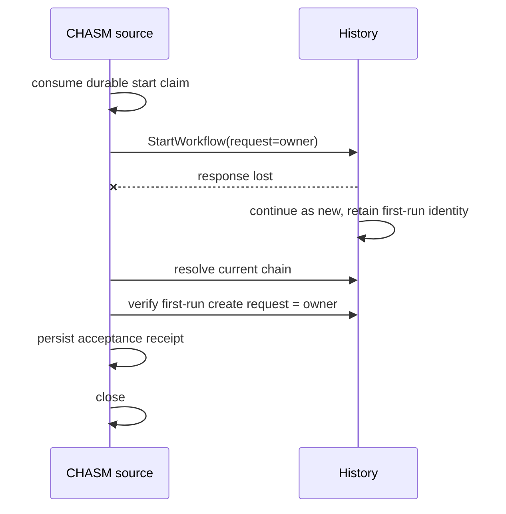
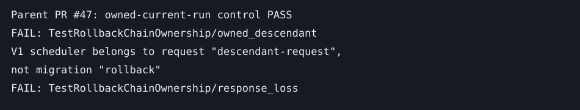

# Rollback ownership across continue-as-new

Extends PR #47 / stack #49. Base: 735701fda. Seeds are the named cases in `TestRollbackChainOwnership`.

A V1 continue-as-new retains its authoritative FirstExecutionRunId but generates a new CreateRequestId. PR #47 compares the collision's current StartRequestId with the migration request and therefore rejects an owned descendant. The owned-current-run control passes on #47; owned-descendant and lost-response/descendant cases fail. The failure is reproduced against the parent in an isolated worktree.

The fix resolves the exact collision run through History GetMutableState, then verifies the first run's durable ExecutionState.CreateRequestId through DescribeMutableState. Both namespace and workflow/run keys are fixed by the source operation. A foreign first-run owner, missing chain identity, or expired first-run record fails closed. The mutable-state continue-as-new test already asserts preservation of FirstExecutionRunId.

Two additive internal fields are carried in replicated WorkflowMigrationState: `start_pending` and `destination_first_run_id`. The former is set only when a new migration begins and consumed atomically before its single external start attempt. Concurrent/retried executors reconcile instead of starting another snapshot. The latter records verified acceptance before source closure, so a later retry closes the source without recreating a destination that has continued as new, completed, or been deleted.

Consuming the start claim is necessary: retrying ALLOW_DUPLICATE after an owned descendant has closed can create another chain without producing a collision. Read-before-start does not fence that race. Missing `start_pending` on older persisted migrations means reconcile-only, never permission to issue another start.

Tests cover owned current run, owned descendant, foreign chain, expired first run, start-response loss, receipt-response loss, source-close loss, and duplicate delivery. The existing retry-boundary tests now assert fail-closed behavior when an ambiguous start left no destination to verify. Component-engine faults operate before/after committed transitions; they do not simulate a physical History crash or multi-cluster failover.

Operator boundary: a consumed start claim with no surviving destination proof cannot distinguish crash-before-start from a committed-and-deleted destination. The source remains paused, and operators must reconcile the operation before recovery. This is an intentional availability tradeoff, not an automatic retry of creation. Old executor binaries ignore these fields; drain them before relying on this protocol. No V1 workflow command behavior changes, so no new workflow version is activated. Existing V1 replay tests still apply.

The receipt costs two scalar fields per in-progress operation; ownership recovery takes two keyed History reads rather than scanning workflow history. The source request ID is rechecked at claim, receipt, and close transitions. No new public APIs or third-party dependencies are introduced.

Upstream audit on 2026-09-04 found no matching scheduler rollback-chain fix. PR #11942 concerns namespace replication verification and is unrelated. Independent delete/forward-ingress fencing remains dependent on PR #44.
