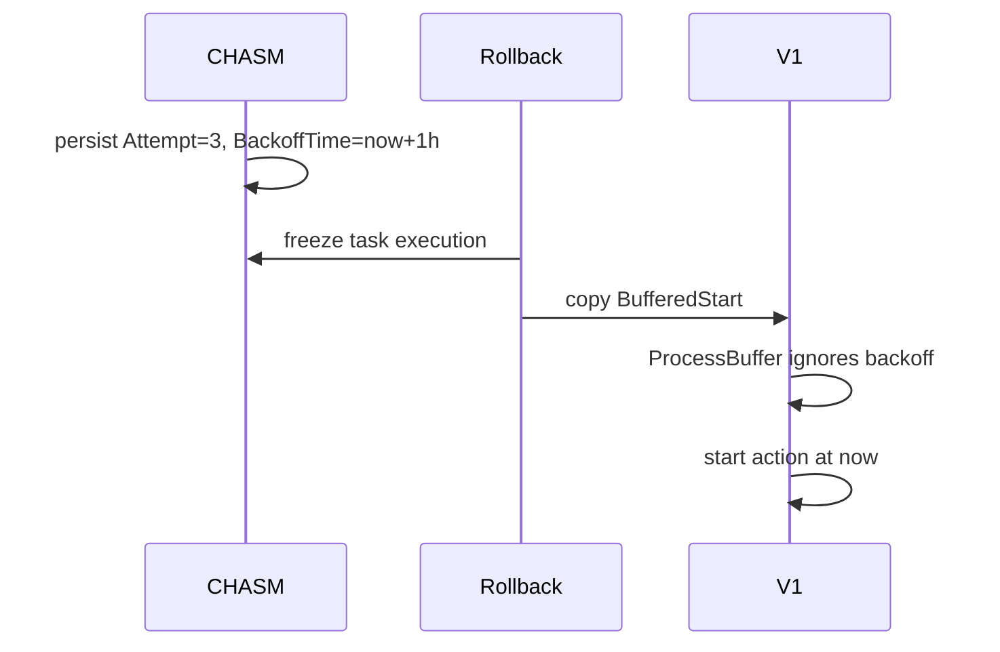
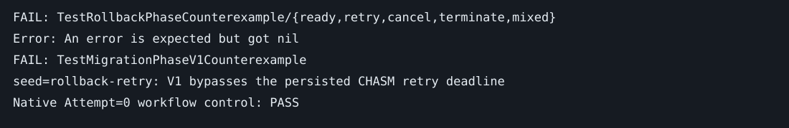

# Rollback cannot represent committed invoker phases

Base: ad7b2298d. Deterministic seeds: `rollback-ready`, `rollback-retry`, `rollback-cancel`, `rollback-terminate`, `rollback-mixed`.

Invariant: migration may not discard a committed cancellation/termination or restart an action's retry/overlap decision. Native CHASM retains executable cancel/terminate queues and honors each start's attempt/backoff. V1 copies the BufferedStart message but `processBuffer` ignores Attempt and BackoffTime, recomputes overlap, and starts through a new local-activity retry policy. The converter never exports CancelWorkflows or TerminateWorkflows.

The SDK counterexample starts an imported manual ALLOW_ALL action with Attempt=3 and a backoff one hour in the future. V1 invokes the action at the current logical time with the same request/workflow IDs. Its native Attempt=0 control passes. The component matrix verifies native ExecuteTask eligibility for ready starts and committed side-effect queues, and requires rollback to reject these untransferable phases while preserving the source. All five rejection assertions fail before the fix.

The loss is not repaired by serializing additional BufferedStart fields: those fields already survive conversion. A safe implementation must either version V1 behavior to consume the CHASM phase, or retain native ownership until the phase drains. This stack chooses the latter, with a retryable error before setting WorkflowMigration or pausing the schedule. Running/completed records and not-yet-attempted/deferred starts remain transferable. No V1 workflow commands change, and no additive protobuf fields are needed.

Controls: `go test -tags test_dep ./chasm/lib/scheduler ./service/worker/scheduler -run '^TestRollbackPhase|^TestMigrationPhaseV1' -count=1`.
Counterexamples: `TEMPORAL_RUN_MIGRATION_COUNTEREXAMPLES=1 go test -tags test_dep ./chasm/lib/scheduler ./service/worker/scheduler -run '^TestRollbackPhaseCounterexample$|^TestMigrationPhaseV1Counterexample$' -count=1`.

Upstream: all open public PRs searched on 2026-09-04. #11316/#11281 concern native retry catchup enforcement, not transfer of an already persisted invoker phase; #11880 concerns data transforms but does not add V1 execution of phase queues. No matching fix found.

A previously pending migration from an older executor is different: its destination may already have committed. The migration task must fail closed if it discovers an untransferable phase; it cannot automatically clear WorkflowMigration and resume CHASM without proving no destination exists. Operators must reconcile the destination before repairing such state. Old task binaries must be drained before relying on the new guard. This does not solve the independent ownership protocol from #44/#47.

Complexity is O(buffer length) without copying or new storage. Gate rejection preserves all existing successor tasks and identities, so native retry limits continue to apply. Migration clients must retry the rejected request; no durable migration intent is recorded on rejection. Namespace failover uses the existing CHASM transaction fences; no real multi-cluster fault experiment is claimed. V1 below MigrationHandoffFixes also rewrites imported identities, an existing compatibility boundary that this guard does not change.
