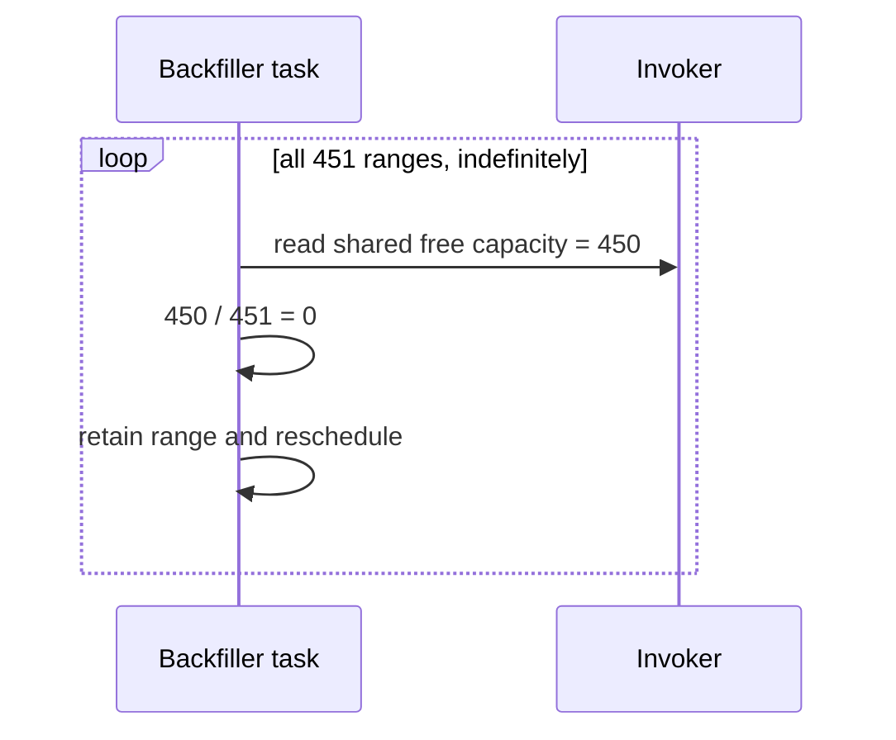
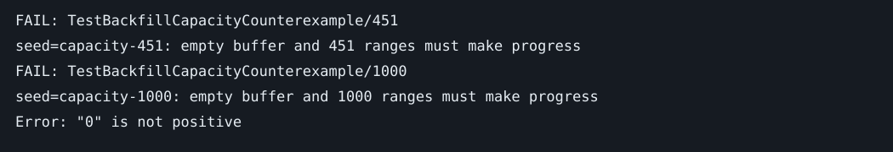

# Backfiller capacity truncation prevents progress

Base: ad7b2298d. Seeds: `capacity-450`, `capacity-451`, `capacity-1000`.
Invariant: finite backfills with positive global capacity must eventually enqueue their actions without exceeding the shared budget.

The component-engine test installs concurrent one-instant ranges on a paused minute schedule. All ranges share their boundary and ALLOW_ALL policy. It runs creation's immediate tasks and repeatedly drains admitted starts, advancing the logical clock to fire persisted continuations. The 450-range native control completes; 451 and 1000 ranges admit zero starts on their first pass despite an empty buffer. The sequence is deterministic; random backfiller UUIDs do not affect the invariant. Distinct request identities are checked on every drain.

`allowedBufferedStarts` counts all range backfillers. At defaults, `backfillerBufferCapacity` computes `450 / count` for an empty buffer. At 451 the quotient becomes zero. Every task takes the capacity-stalled path, preserving its range and scheduling a backoff. Therefore the divisor never decreases and every subsequent attempt encounters the same state.

Impact: V1 can carry up to 1000 ongoing backfills into CHASM even though native patch admission normally limits concurrency to 100. Migrated ranges above the arithmetic threshold remain stuck indefinitely. A configurable smaller buffer can also expose this below the default native concurrency limit.

Control: `go test -tags test_dep ./chasm/lib/scheduler -run '^TestBackfillCapacityNativeControl$' -count=1`.
Counterexamples: `TEMPORAL_RUN_MIGRATION_COUNTEREXAMPLES=1 go test -tags test_dep ./chasm/lib/scheduler -run '^TestBackfillCapacityCounterexample$' -count=1`.

The fix admits `min(available, max(1, available/count))`. Pure task mutations serialize on the scheduler tree, so every subsequent task recomputes capacity after the preceding enqueue. Zero global capacity still admits zero. The existing retained-history allowance is preserved, so the test's raw buffer bound is 460, equivalent to 450 pending slots after that allowance. This changes no protobuf or V1 workflow code and adds no new replay branch.

Upstream audit: all open public PR titles/bodies fetched on 2026-09-04, with scheduler/backfill/migration candidates inspected. No matching production capacity fix found. Imported invoker activation is separately covered by #11557, and the fresh reverse-boundary defect by #11878.

Ordering is separate from admission: native CHASM range task order is unspecified and reverse conversion iterates a map. Sorting ranges alone would not reproduce a guaranteed native order. Equal boundaries with distinct policies can therefore have order-dependent overlap outcomes; this report does not claim deterministic action equivalence across migration for that hypothesis. Capacity admission neither changes range cursors nor introduces a map-order guarantee.

Crash/failover reasoning: enqueue, cursor advancement, and continuation task are one existing CHASM transaction. The change introduces no new external side effect or unreplicated state. These tests exercise committed component transactions, not actual History crashes or namespace failover. Counting all backfillers still costs O(N) per task; this fix addresses liveness, not that existing aggregate O(N²) scan cost.
