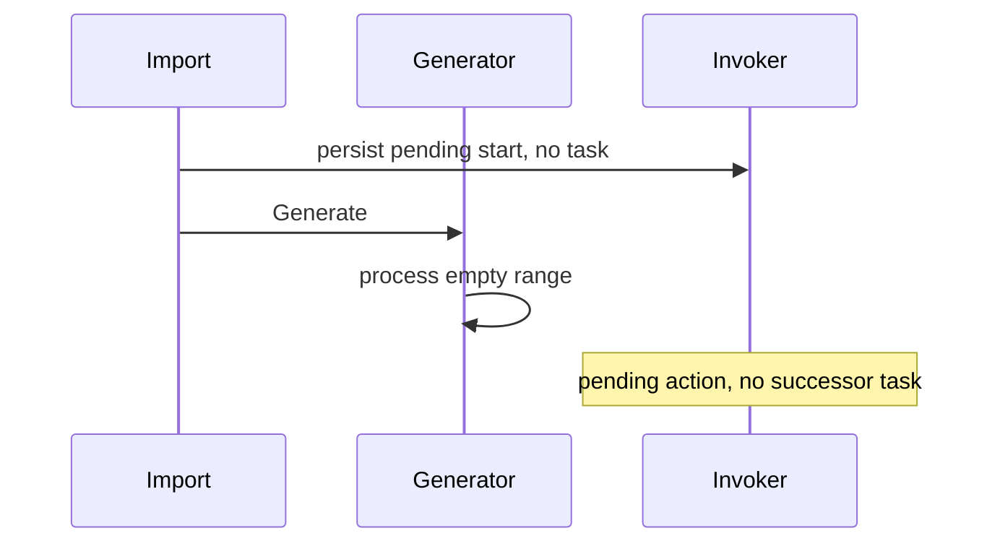

# Imported buffers: confirmed, already covered upstream

Base: ad7b2298d. Seed: `import-buffer`, fixed logical time 2026-09-04T12:00:00Z.
Invariant: an imported pending action must have a successor task even when no new schedule occurrence is generated.

The component-engine test creates a paused, manual-only schedule with one pending manual ALLOW_ALL start, no running workflows and no backfillers. Creation and every immediate pure task commit. No transfer task exists. Native `EnqueueBufferedStarts` on the same state dispatches the exact request/workflow identity once; duplicate execution delivery invalidates.

Cause: `CreateSchedulerFromMigration` initializes an inactive invoker and, in the no-callback branch, calls only `Generator.Generate`. `GeneratorTaskHandler.Execute` calls `EnqueueBufferedStarts` only for a nonempty generated batch. A paused/manual-only spec supplies no such batch. An idle timer cannot execute the pending action.

Ordinary native control passes:
`go test -tags test_dep ./chasm/lib/scheduler -run '^TestMigrationImportedBuffer' -count=1`

Opt-in deterministic counterexample fails:
`TEMPORAL_RUN_MIGRATION_COUNTEREXAMPLES=1 go test -tags test_dep ./chasm/lib/scheduler -run '^TestMigrationImportedBufferCounterexample$' -count=1`

Upstream audit on 2026-09-04 found [PR #11557](https://github.com/temporalio/temporal/pull/11557), whose production patch adds exactly `sched.Invoker.Get(ctx).addTasks(ctx)` before generator activation. This is a matching fix, so no independent fix stack or PR is submitted. Callback-bearing state remains deferred in that patch. Native controls establish dispatch behavior; this component test does not simulate namespace failover or physical process crashes.
